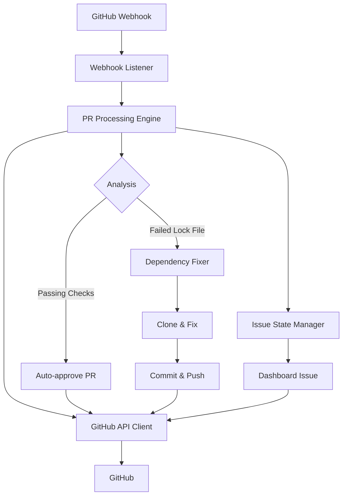

# Renovate PR Assistant

<p align="center">
  
  
  
</p>

An intelligent automation system that streamlines dependency management by automatically reviewing and managing [Renovate](https://github.com/renovatebot/renovate) pull requests across GitHub organizations.

## 🚀 Features

### ✅ Automated PR Review and Approval
- **Smart Detection**: Automatically identifies Renovate PRs across your organization
- **Status Validation**: Verifies all pre-merge checks (CI/CD, tests, security scans) are passing
- **Instant Approval**: Approves PRs that meet quality criteria without manual intervention
- **Safety First**: Only processes PRs from the official Renovate bot

### 🔧 Automated Dependency Resolution
- **Lock File Fixing**: Automatically updates lock files when Renovate fails to do so
- **Multi-Language Support**: Handles Python (Poetry), TypeScript/JavaScript (npm/yarn), and Go dependencies
- **Intelligent Cloning**: Safely clones repositories, applies fixes, and pushes changes back
- **Rollback Protection**: Comprehensive error handling with automatic rollback on failures

### 📊 Repository Health Dashboard
- **Centralized Monitoring**: Creates and maintains a dashboard issue in each repository
- **Real-time Status**: Shows all open Renovate PRs with their current status
- **Blocked PR Detection**: Identifies PRs stuck due to rate limiting, conflicts, or manual approval needs
- **Structured Data**: Maintains machine-readable data alongside human-friendly reports

## 🏗️ Architecture



### Core Components

- **🎯 GitHub Webhook Listener**: Receives and processes GitHub events in real-time
- **🧠 PR Processing Engine**: Intelligent decision-making for PR handling
- **🔧 Dependency Fixer**: Language-specific dependency resolution
- **📡 GitHub API Client**: Robust GitHub integration with rate limiting and error handling
- **📋 Issue State Manager**: Maintains repository health dashboards

## 🛠️ Quick Start

### Prerequisites

- Python 3.8 or higher
- Git
- A GitHub App with appropriate permissions OR a GitHub Personal Access Token (for development)
- Virtual environment (recommended)

### Installation

1. **Clone the repository**
   ```bash
   git clone https://github.com/your-org/renovate-agent.git
   cd renovate-agent
   ```

2. **Set up Python environment**
   ```bash
   python -m venv venv
   source venv/bin/activate  # On Windows: venv\Scripts\activate
   pip install -r requirements.txt
   pip install -e .
   ```

3. **Configure environment**
   ```bash
   cp .env.example .env
   # Edit .env with your configuration (see Configuration section)
   ```

4. **Run the application**
   ```bash
   # For production with GitHub App
   renovate-agent
   # Or: uvicorn renovate_agent.main:app --reload

   # For local development with Personal Access Token
   # See LOCAL_TESTING.md for simplified setup
   python -m renovate_agent.main
   ```

## ⚙️ Configuration

### GitHub App Setup

Create a GitHub App with these permissions:

**Repository permissions:**
- Contents: Write ✏️
- Issues: Write ✏️
- Pull requests: Write ✏️
- Checks: Read 👁️
- Metadata: Read 👁️

**Webhook events:**
- `pull_request` (opened, synchronize, closed)
- `check_suite` (completed)
- `issues` (opened, closed, labeled)

### Environment Variables

```bash
# GitHub Organization (Required)
GITHUB_ORGANIZATION=your-organization

# GitHub Authentication (Choose one)
# Option 1: GitHub App (Production)
GITHUB_APP_ID=your_github_app_id
GITHUB_APP_PRIVATE_KEY_PATH=path/to/private-key.pem
GITHUB_WEBHOOK_SECRET=your_webhook_secret

# Option 2: Personal Access Token (Development)
GITHUB_APP_ID=0
GITHUB_PERSONAL_ACCESS_TOKEN=your_pat_token

# Repository Management (Optional)
GITHUB_REPOSITORY_ALLOWLIST=repo1,repo2,repo3  # If empty, monitors all repos
GITHUB_TEST_REPOSITORIES=org/repo1,org/repo2    # For testing

# Server Configuration
HOST=0.0.0.0
PORT=8000
DEBUG=false

# Dependency Fixing
ENABLE_DEPENDENCY_FIXING=true
SUPPORTED_LANGUAGES=python,typescript,go
CLONE_TIMEOUT=300
DEPENDENCY_UPDATE_TIMEOUT=600
```

## 🔍 How It Works

### 1. PR Detection
The system listens for GitHub webhook events and identifies new Renovate PRs automatically.

### 2. Status Verification
For each PR, it checks:
- ✅ All CI/CD checks are passing
- ✅ No merge conflicts exist
- ✅ PR is from the official Renovate bot
- ✅ Repository is configured for automation

### 3. Automated Actions

**If all checks pass:**
- Automatically approves the PR
- Updates the dashboard issue
- Logs the action for audit purposes

**If dependency fixing is needed:**
- Clones the repository to a temporary location
- Runs appropriate dependency update commands
- Commits and pushes the fixes
- Updates the PR with the resolved dependencies

### 4. Dashboard Updates
Maintains a real-time dashboard showing:
- Open Renovate PRs and their status
- Recently processed PRs
- Blocked PRs requiring attention
- Repository health metrics

## 🌐 Language Support

### Python (Poetry)
```bash
# Automatically runs:
poetry lock --no-update
poetry install
```

### TypeScript/JavaScript (npm/yarn)
```bash
# Automatically runs:
npm install  # or yarn install
npm ci       # for production builds
```

### Go
```bash
# Automatically runs:
go mod tidy
go mod download
```

## 📈 Monitoring and Observability

### Health Checks
- `/health` - Basic application health
- `/` - Root endpoint with application status

### Metrics
The system tracks:
- PRs processed per hour
- Success rate of dependency fixes
- GitHub API rate limit usage
- Processing time per PR

### Logging
Structured logging with configurable levels:
```bash
LOG_LEVEL=INFO
LOG_FORMAT=json
```

## 🛡️ Security

### Webhook Validation
All incoming webhooks are validated using HMAC signatures to ensure authenticity.

### Rate Limiting
Built-in rate limiting prevents abuse and respects GitHub API limits.

### Private Key Management
Secure handling of GitHub App private keys with proper rotation practices.

## 🚀 Deployment

### Docker
```dockerfile
FROM python:3.12-slim

WORKDIR /app
COPY requirements.txt .
RUN pip install -r requirements.txt

COPY src/ ./src/
COPY setup.py .
RUN pip install -e .

EXPOSE 8000
CMD ["uvicorn", "renovate_agent.main:app", "--host", "0.0.0.0", "--port", "8000"]
```

### Production Considerations
- Use PostgreSQL for production databases
- Deploy behind a reverse proxy (nginx)
- Enable SSL/TLS certificates
- Set up monitoring and alerting
- Configure log aggregation

## 🧪 Testing

### Run Tests
```bash
pytest tests/
pytest --cov=renovate_agent tests/  # With coverage
```

### Integration Tests
```bash
pytest tests/integration/ -m integration
```

## 📚 Documentation

- **[Developer Guide](docs/developer.md)** - Comprehensive development documentation
- **[API Documentation](docs/api.md)** - REST API reference
- **[Architecture Guide](docs/architecture.md)** - System design and patterns
- **[Deployment Guide](docs/deployment.md)** - Production deployment instructions

## 🤝 Contributing

We welcome contributions! Please see our [Contributing Guide](CONTRIBUTING.md) for details.

### Development Setup
```bash
# Install development dependencies
pip install -r requirements.txt -e .[dev]

# Set up pre-commit hooks
pre-commit install

# Run the test suite
pytest
```

### Code Style
- Follow PEP 8 guidelines
- Use Black for code formatting
- Write comprehensive docstrings
- Include type hints

## 📄 License

This project is licensed under the MIT License - see the [LICENSE](LICENSE) file for details.

## 🙏 Acknowledgments

- [Renovate](https://github.com/renovatebot/renovate) - The amazing dependency update tool
- [PyGithub](https://github.com/PyGithub/PyGithub) - GitHub API client
- [FastAPI](https://fastapi.tiangolo.com/) - Modern Python web framework
- [Pydantic](https://pydantic-docs.helpmanual.io/) - Data validation using Python type hints

## 📞 Support

- 💬 Issues: [GitHub Issues](https://github.com/your-org/renovate-agent/issues)
- 📖 Documentation: [docs/](docs/)
- 📋 Local Testing: [LOCAL_TESTING.md](LOCAL_TESTING.md)

---

<p align="center">
  Made with ❤️ by the Renovate PR Assistant Team
</p>
