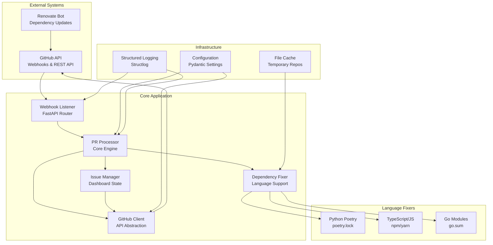
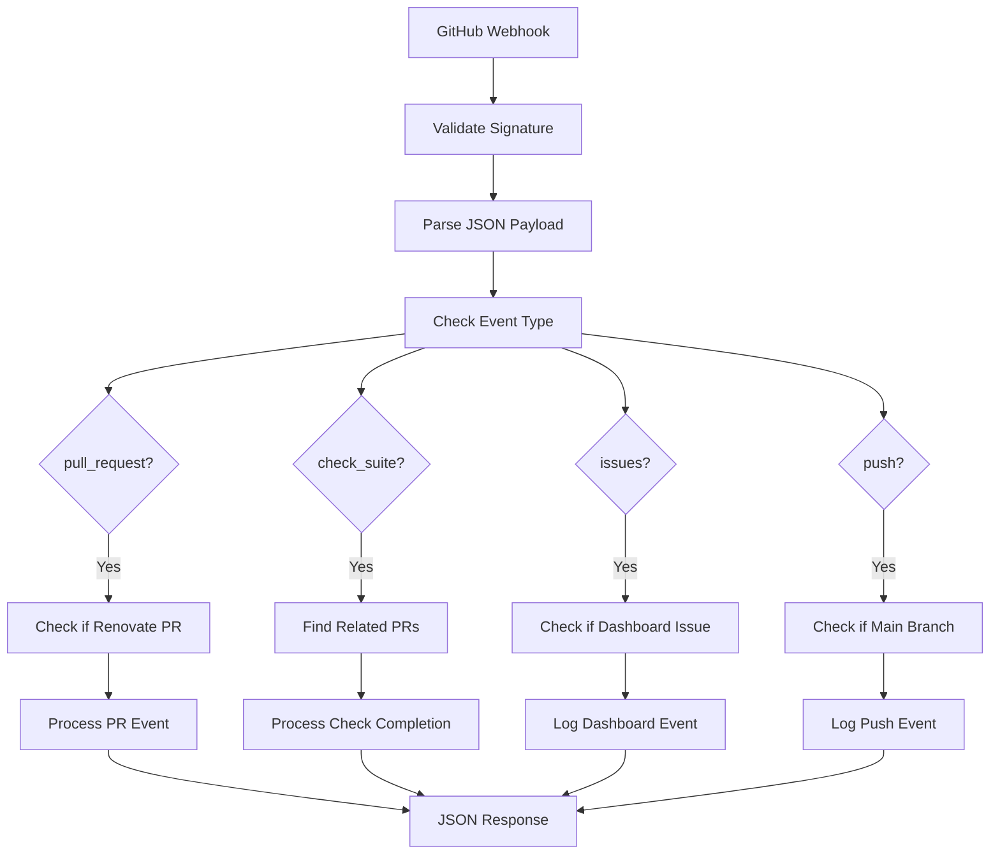
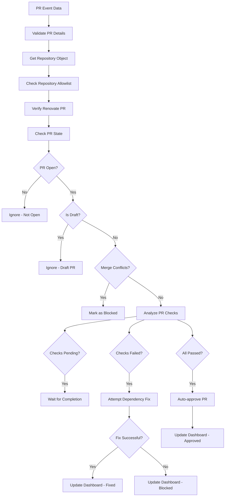
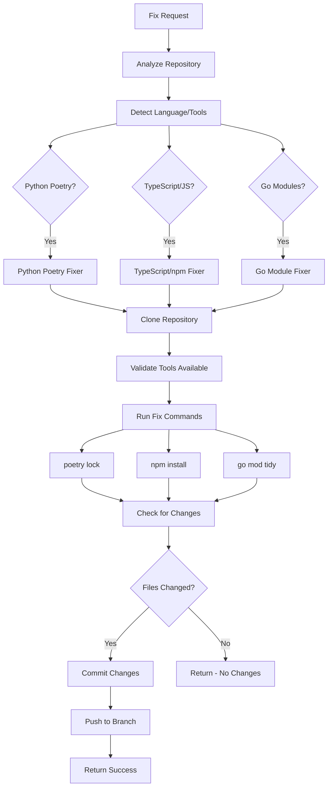

# RenovateAgent System Architecture

## Overview

RenovateAgent is an intelligent automation system that streamlines dependency management by automatically reviewing and managing [Renovate](https://github.com/renovatebot/renovate) pull requests across GitHub organizations. The system focuses on automated PR approval, dependency fixing, and repository health monitoring to reduce manual intervention in dependency updates.

**Last Updated**: 2025-07-08
**Version**: Current Architecture v0.1.0

## System Architecture



## Data Flow

### 1. Webhook Processing Flow



### 2. PR Analysis and Decision Flow



### 3. Dependency Fixing Workflow



## Component Details

### Webhook Listener

**Purpose**: Receives and validates GitHub webhook events, routing them to appropriate processors.

**Key Methods**:
- `handle_github_webhook()` - Main webhook endpoint handler
- `_validate_signature()` - HMAC signature validation
- `_process_event()` - Event type routing
- `_process_pull_request_event()` - PR event processing
- `_process_check_suite_event()` - Check suite completion handling

**Security Features**:
- HMAC SHA-256 signature validation
- Development mode bypass for testing
- Rate limiting protection
- Input validation and sanitization

**Supported Events**:
- `pull_request` (opened, synchronize, reopened, ready_for_review)
- `check_suite` (completed)
- `issues` (for dashboard management)
- `push` (main branch monitoring)

### PR Processor

**Purpose**: Core decision engine for analyzing and processing Renovate PRs.

**Key Methods**:
- `process_pr_event()` - Main PR processing logic
- `process_check_suite_completion()` - Handle check completion
- `_process_pr_for_approval()` - PR approval analysis
- `_analyze_pr_checks()` - Check status analysis
- `_attempt_dependency_fix()` - Trigger dependency fixing

**Decision Logic**:
1. **Validation**: Verify PR is from Renovate bot
2. **State Checks**: Ensure PR is open, not draft, no conflicts
3. **Check Analysis**: Evaluate CI/CD check status
4. **Action Determination**: Approve, fix dependencies, or block
5. **Dashboard Updates**: Maintain repository health status

### GitHub Client

**Purpose**: Robust GitHub API client with authentication, rate limiting, and error handling.

**Authentication Modes**:
- **GitHub App**: Production mode with JWT and installation tokens
- **Personal Access Token**: Development mode for testing

**Key Methods**:
- `_authenticate()` - Handle GitHub App or PAT authentication
- `get_repo()` - Repository object retrieval
- `get_pr()` - Pull request object retrieval
- `is_renovate_pr()` - Renovate bot detection
- `approve_pr()` - PR approval with review
- `commit_file()` - File updates and commits

**Rate Limiting**:
- Automatic rate limit detection and respect
- Exponential backoff on rate limit hits
- Rate limit status monitoring and logging

### Dependency Fixer Factory

**Purpose**: Language detection and appropriate dependency fixer selection.

**Supported Languages**:
- **Python**: Poetry package manager (`poetry.lock`)
- **TypeScript/JavaScript**: npm/yarn package managers (`package-lock.json`, `yarn.lock`)
- **Go**: Go modules (`go.sum`)

**Selection Logic**:
1. **Repository Analysis**: Scan for language-specific files
2. **Tool Detection**: Identify package managers and build tools
3. **Fixer Matching**: Select appropriate language-specific fixer
4. **Tool Validation**: Ensure required tools are available

### Language-Specific Fixers

#### Python Poetry Fixer
- **Detection**: `pyproject.toml` with `[tool.poetry]` section
- **Commands**: `poetry lock --no-update`, `poetry install`
- **Lock Files**: `poetry.lock`
- **Validation**: Poetry CLI availability check

#### TypeScript/JavaScript npm Fixer
- **Detection**: `package.json` presence
- **Package Manager**: Auto-detect npm vs yarn by lock files
- **Commands**: `npm install` / `npm ci` or `yarn install`
- **Lock Files**: `package-lock.json`, `yarn.lock`
- **Validation**: npm/yarn CLI availability check

#### Go Module Fixer
- **Detection**: `go.mod` with valid module declaration
- **Commands**: `go mod tidy`, `go mod download`
- **Lock Files**: `go.sum`
- **Validation**: Go CLI availability check

### Issue State Manager

**Purpose**: Maintains repository health dashboards through GitHub issues.

**Dashboard Features**:
- **Structured Data**: JSON data in HTML comments
- **Human-Readable Reports**: Markdown tables and status
- **Real-time Updates**: PR status tracking
- **Historical Data**: Recently processed PRs
- **Statistics**: Success rates and metrics

**Key Methods**:
- `get_or_create_dashboard_issue()` - Dashboard issue management
- `update_dashboard_issue()` - Status updates
- `_collect_repository_data()` - Repository health data
- `_generate_human_readable_report()` - Markdown report generation

## Configuration System

### Environment Variables

**GitHub Authentication**:
```bash
# Production (GitHub App)
GITHUB_APP_ID=123456
GITHUB_APP_PRIVATE_KEY_PATH=/path/to/private-key.pem
GITHUB_WEBHOOK_SECRET=your-webhook-secret

# Development (Personal Access Token)
GITHUB_APP_ID=0
GITHUB_PERSONAL_ACCESS_TOKEN=ghp_your-token
```

**Repository Management**:
```bash
GITHUB_ORGANIZATION=your-organization
GITHUB_REPOSITORY_ALLOWLIST=repo1,repo2,repo3  # Optional filtering
GITHUB_TEST_REPOSITORIES=org/test-repo1,org/test-repo2
```

**Dependency Fixing**:
```bash
ENABLE_DEPENDENCY_FIXING=true
SUPPORTED_LANGUAGES=python,typescript,go
CLONE_TIMEOUT=300
DEPENDENCY_UPDATE_TIMEOUT=600
```

**Server Configuration**:
```bash
HOST=0.0.0.0
PORT=8000
DEBUG=false
LOG_LEVEL=INFO
LOG_FORMAT=json
```

### Configuration Validation

- **Field Validation**: Pydantic-based configuration validation
- **Environment Loading**: Automatic `.env` file loading
- **Type Conversion**: String-to-list conversion for comma-separated values
- **Default Values**: Sensible defaults for all settings
- **Development Mode**: Automatic detection based on authentication method

## Performance Characteristics

### Webhook Processing Performance

- **Simple Events**: 50-100ms response time
- **PR Analysis**: 200-500ms for status checks
- **Dependency Fixing**: 30-180 seconds (depends on repository size)
- **Dashboard Updates**: 100-300ms for issue updates

### GitHub API Usage

- **Rate Limit Awareness**: Automatic detection and respect
- **Efficient Calls**: Minimize API calls through caching
- **Batch Operations**: Group related API calls when possible
- **Error Handling**: Graceful degradation on API failures

### Resource Usage

- **Memory**: 50-100MB baseline, 200-500MB during dependency fixing
- **CPU**: Low baseline, high during git operations and dependency resolution
- **Disk**: Temporary repository clones (cleaned up automatically)
- **Network**: GitHub API calls and git operations

## Security Architecture

### Authentication Security

- **GitHub App**: Secure JWT-based authentication with short-lived tokens
- **Private Key**: Secure storage and access to GitHub App private keys
- **Webhook Validation**: HMAC SHA-256 signature verification
- **Token Rotation**: Automatic installation token refresh

### Input Validation

- **Webhook Signatures**: Cryptographic validation of all incoming webhooks
- **JSON Parsing**: Safe JSON parsing with error handling
- **Parameter Validation**: Pydantic-based input validation
- **Repository Filtering**: Allowlist-based repository access control

### Operational Security

- **Temporary Files**: Secure temporary directory usage
- **Git Operations**: Isolated repository clones with cleanup
- **Error Handling**: No sensitive data in error messages
- **Logging**: Structured logging without sensitive information

## Deployment Considerations

### Container Deployment

**Docker Configuration**:
```dockerfile
FROM python:3.12-slim
WORKDIR /app
COPY requirements.txt .
RUN pip install -r requirements.txt
COPY src/ ./src/
RUN pip install -e .
EXPOSE 8000
CMD ["uvicorn", "renovate_agent.main:app", "--host", "0.0.0.0", "--port", "8000"]
```

**Docker Compose**:
- **Application**: RenovateAgent service
- **Database**: PostgreSQL for production
- **Cache**: Redis for session management
- **Proxy**: Nginx for SSL termination

### Production Requirements

- **Reverse Proxy**: Nginx or similar for SSL/TLS termination
- **Database**: PostgreSQL for persistent storage
- **Monitoring**: Health checks and metrics collection
- **Logging**: Centralized log aggregation
- **Secrets**: Secure private key and token management

### Scaling Considerations

- **Horizontal Scaling**: Multiple instances behind load balancer
- **Database Scaling**: Read replicas for dashboard queries
- **Cache Layer**: Redis for session and temporary data
- **Background Jobs**: Queue system for long-running dependency fixes

## Error Handling and Resilience

### Error Categories

1. **GitHub API Errors**: Rate limiting, authentication, network issues
2. **Dependency Fixing Errors**: Tool failures, compilation errors, conflicts
3. **Configuration Errors**: Missing settings, invalid values
4. **Infrastructure Errors**: Database connectivity, file system issues

### Recovery Strategies

- **Exponential Backoff**: Automatic retry with increasing delays
- **Circuit Breaker**: Temporary service degradation on repeated failures
- **Graceful Degradation**: Continue operation with reduced functionality
- **Manual Intervention**: Clear error reporting for human review

### Monitoring and Alerting

- **Health Endpoints**: `/health` for application status
- **Metrics Collection**: PR processing rates, success rates, API usage
- **Error Tracking**: Structured error logging with context
- **Dashboard Monitoring**: Repository health status tracking

## Architecture Benefits

### Automation Efficiency

- **Reduced Manual Work**: Automatic PR approval for passing checks
- **Fast Dependency Resolution**: Automated lock file updates
- **Proactive Monitoring**: Real-time repository health dashboards
- **Scalable Processing**: Handle multiple repositories simultaneously

### Reliability and Safety

- **Conservative Approval**: Only approve PRs with all checks passing
- **Rollback Protection**: Comprehensive error handling with cleanup
- **Audit Trail**: Complete logging of all actions taken
- **Security First**: Cryptographic validation of all inputs

### Developer Experience

- **Transparent Operations**: Clear dashboard showing all PR status
- **Minimal Configuration**: Simple environment variable setup
- **Local Development**: Personal Access Token mode for testing
- **Comprehensive Logging**: Detailed troubleshooting information

## Future Architecture Considerations

### Scalability Enhancements

- **Microservices**: Split into specialized services (webhook, processor, fixer)
- **Message Queues**: Asynchronous processing with Redis/RabbitMQ
- **Database Sharding**: Partition data by organization or repository
- **CDN Integration**: Cache static dashboard content

### Feature Extensions

- **Multi-Platform Support**: GitLab, Bitbucket integration
- **Advanced Analytics**: Dependency update trends and insights
- **Custom Rules**: Organization-specific approval criteria
- **Integration APIs**: External tool integration points

### Operational Improvements

- **Observability**: Distributed tracing and metrics
- **Disaster Recovery**: Multi-region deployment capabilities
- **Performance Optimization**: Caching and query optimization
- **Security Hardening**: Enhanced authentication and authorization

---

This architecture emphasizes reliability, security, and automation while maintaining simplicity and operational transparency. The modular design allows for easy extension and customization while providing robust dependency management automation for modern development workflows.
