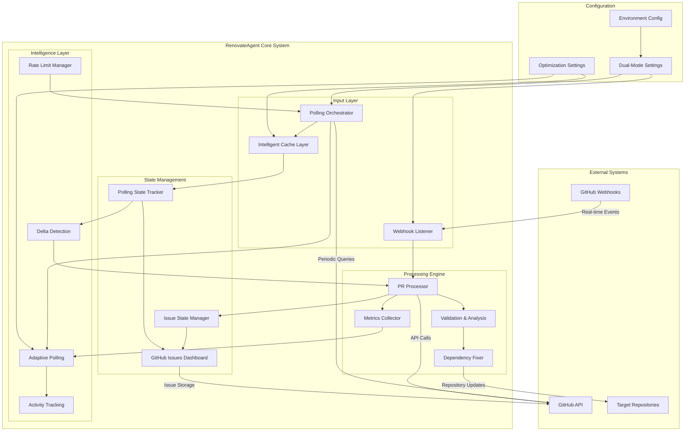

# RenovateAgent System Architecture

## Overview

RenovateAgent is an intelligent automation system that streamlines dependency management by automatically reviewing and managing [Renovate](https://github.com/renovatebot/renovate) pull requests across GitHub organizations. The system follows a **stateless architecture** with GitHub Issues as the sole state store, supporting both **webhook-driven** and **polling-based** operation modes with advanced optimizations for maximum deployment flexibility, focusing on automated PR approval, dependency fixing, and repository health monitoring to reduce manual intervention in dependency updates.

**Last Updated**: 2025-07-09
**Version**: Current Architecture v0.5.0 (Phase 2 Complete - Optimized Dual-Mode Operation)

## System Architecture



## Operation Modes

### Webhook Mode (Traditional)
- **Trigger**: GitHub webhook events (push, PR actions)
- **Latency**: Near real-time (<5 seconds)
- **Network**: Requires inbound connectivity
- **Use Cases**: Standard deployments, cloud environments
- **Resource Usage**: Event-driven, minimal background load

### Polling Mode (Phase 2 Optimized)
- **Trigger**: Intelligent periodic GitHub API queries
- **Latency**: 1-15 minutes (adaptive based on repository activity)
- **Network**: Outbound-only connectivity
- **Use Cases**: Corporate firewalls, private networks, air-gapped environments
- **Resource Usage**: Background processing with smart optimizations

#### Phase 2 Polling Optimizations

**Adaptive Intervals**:
- Repository activity scoring (0.0-1.0)
- Dynamic interval adjustment (1-15 minutes)
- High activity repos: 1-2 minute polling
- Medium activity repos: 2-5 minute polling
- Low activity repos: 5-15 minute polling
- Consecutive empty polls trigger exponential backoff

**Delta State Detection**:
- PR state hashing for change detection
- Only process PRs with actionable changes
- Tracks: state, commits, merge status, check runs, conflicts
- Reduces unnecessary processing by 60-80%

**Intelligent Caching**:
- Multi-layer cache with TTL-based expiration
- Repository metadata cache (10 minutes)
- PR list cache (2 minutes)
- Renovate detection cache (30 minutes)
- Check runs cache (1 minute)
- Automatic cleanup and hit rate monitoring

**Performance Metrics**:
- Real-time cycle monitoring
- Repository-specific performance tracking
- Health scoring and status indicators
- Rate limit monitoring and adaptive throttling
- Cache hit rate optimization

### Dual Mode (Redundant)
- **Operation**: Both webhook and polling simultaneously
- **Benefits**: Maximum reliability, cross-validation
- **Deduplication**: Automatic via state tracking
- **Use Cases**: Critical environments, migration scenarios

## Core Components

### 1. Webhook Listener (webhooks/)
**File**: `src/renovate_agent/webhooks/`
- Validates GitHub webhook signatures
- Routes PR events to processor
- Handles GitHub API authentication
- Supports both GitHub App and Personal Access Token authentication

### 2. Polling Orchestrator (polling/)
**File**: `src/renovate_agent/polling/orchestrator.py`
- **Phase 2 Enhanced**: Adaptive scheduling with activity-based prioritization
- Concurrent repository processing with intelligent batching
- Repository activity tracking and scoring
- Global backoff mechanism for rate limit management
- Graceful error handling and recovery

### 3. PR Processor (pr_processor.py)
**File**: `src/renovate_agent/pr_processor.py`
- Unified processing for both webhook and polling modes
- Renovate PR detection and validation
- Auto-approval logic with safety checks
- Integration with dependency fixing pipeline
- Comprehensive logging and error tracking

### 4. Dependency Fixer (dependency_fixer/)
**File**: `src/renovate_agent/dependency_fixer/`
- **Language Support**: Python, TypeScript/JavaScript, Go
- **Python**: pip, pipenv, poetry, conda support
- **TypeScript/JS**: npm, yarn, pnpm support
- **Go**: go mod support
- **Features**: Version validation, security scanning, build verification

### 5. State Management
**Files**: `src/renovate_agent/issue_manager.py`, `src/renovate_agent/polling/state_tracker.py`
- **Issue State Manager**: GitHub Issues as primary state store
- **Polling State Tracker (Phase 2)**: Advanced state tracking with delta detection
- **Features**: PR state caching, processed PR tracking, deduplication
- **Storage**: JSON embedded in GitHub Issue bodies
- **Dashboard**: Real-time status and metrics display

### 6. Intelligence Layer (Phase 2)

**Adaptive Polling** (`polling/orchestrator.py`):
- Repository activity scoring and classification
- Dynamic interval calculation based on patterns
- Priority queue for high-activity repositories
- Intelligent backoff strategies

**Delta Detection** (`polling/state_tracker.py`):
- PR state fingerprinting with MD5 hashing
- Actionable change identification
- State persistence and comparison
- Conflict and check status monitoring

**Caching Layer** (`polling/cache.py`):
- In-memory cache with configurable TTL
- Repository-specific cache namespacing
- Automatic expiration and cleanup
- Performance metrics and hit rate tracking

**Metrics Collection** (`polling/metrics.py`):
- Real-time performance monitoring
- Health scoring and status indicators
- Repository-specific analytics
- Rate limit and error tracking

### 7. Rate Limit Management
**File**: `src/renovate_agent/polling/rate_limiter.py`
- **Phase 2 Enhanced**: Predictive rate limit monitoring
- GitHub API quota tracking and forecasting
- Intelligent throttling with adaptive delays
- Per-repository rate limiting
- Emergency backoff mechanisms

## Configuration System

### Environment Variables

#### Core Authentication
```bash
# GitHub App (Production)
GITHUB_APP_ID=123456
GITHUB_APP_PRIVATE_KEY_PATH=/path/to/key.pem
GITHUB_ORGANIZATION=your-org

# Personal Access Token (Development)
GITHUB_PERSONAL_ACCESS_TOKEN=ghp_token
```

#### Operation Mode Configuration
```bash
# Dual-mode operation (Phase 2 Default)
ENABLE_WEBHOOKS=true
ENABLE_POLLING=true

# Polling configuration
POLLING_INTERVAL_MINUTES=2
POLLING_MAX_CONCURRENT_REPOS=5
POLLING_REPOSITORIES=org/repo1,org/repo2

# Phase 2 Optimizations
POLLING_ENABLE_ADAPTIVE_INTERVALS=true
POLLING_ENABLE_DELTA_DETECTION=true
POLLING_ENABLE_CACHING=true
POLLING_CACHE_TTL_SECONDS=300
```

#### Rate Limiting & Performance
```bash
GITHUB_API_RATE_LIMIT=5000
POLLING_RATE_LIMIT_BUFFER=1000
POLLING_RATE_LIMIT_THRESHOLD=0.8
POLLING_METRICS_COLLECTION=true
```

### Adaptive Configuration Loading
- Environment variable validation with defaults
- Runtime configuration updates
- Mode-specific validation (at least one mode must be enabled)
- Backward compatibility with webhook-only deployments

## Data Flow

### Webhook Mode Data Flow
1. **GitHub Event** → Webhook payload received
2. **Authentication** → Signature validation and parsing
3. **Routing** → Event type identification and filtering
4. **Processing** → PR analysis and approval logic
5. **Actions** → Auto-approval, dependency fixing, comments
6. **State Update** → GitHub Issues dashboard update

### Polling Mode Data Flow (Phase 2 Optimized)
1. **Cycle Initiation** → Metrics collection start, repository prioritization
2. **Cache Check** → Repository metadata and PR list cache lookup
3. **API Query** → Intelligent GitHub API calls with rate limiting
4. **Delta Detection** → PR state comparison and change identification
5. **Selective Processing** → Only process PRs with actionable changes
6. **Batch Operations** → Concurrent processing with semaphore control
7. **State Persistence** → Update state cache and GitHub Issues
8. **Metrics Update** → Performance tracking and health scoring
9. **Adaptive Scheduling** → Calculate next cycle delay based on activity

### Dual Mode Coordination
- **Event Deduplication**: State tracking prevents double-processing
- **State Synchronization**: Both modes update shared GitHub Issues state
- **Conflict Resolution**: Webhook events take priority over polling
- **Performance Optimization**: Polling adapts to webhook activity

## Deployment Architectures

### Cloud Deployment (Webhook + Polling)
```yaml
# Recommended for maximum reliability
ENABLE_WEBHOOKS=true
ENABLE_POLLING=true
POLLING_INTERVAL_MINUTES=5  # Backup polling
HOST=0.0.0.0
PORT=8000
```

### Corporate/Firewall Environment (Polling Only)
```yaml
# Outbound-only network access
ENABLE_WEBHOOKS=false
ENABLE_POLLING=true
POLLING_INTERVAL_MINUTES=2
POLLING_ENABLE_ADAPTIVE_INTERVALS=true
```

### Development Environment (Polling Preferred)
```yaml
# Local testing with polling default
ENABLE_WEBHOOKS=false
ENABLE_POLLING=true
GITHUB_PERSONAL_ACCESS_TOKEN=ghp_token
DEBUG=true
```

## Performance Characteristics (Phase 2)

### Polling Mode Performance
- **API Efficiency**: 60-80% reduction in API calls via delta detection
- **Processing Efficiency**: 70-90% reduction in unnecessary processing
- **Cache Hit Rates**: 80-95% for repository metadata, 60-80% for PR lists
- **Adaptive Scaling**: 1-minute intervals for active repos, 15-minute for idle
- **Memory Usage**: <50MB for typical deployments (20-50 repositories)

### Rate Limiting Management
- **Default Limits**: 5,000 requests/hour GitHub API quota
- **Buffer Management**: 1,000 request buffer maintained
- **Threshold Monitoring**: 80% usage triggers throttling
- **Adaptive Backoff**: Exponential delays during rate limit pressure
- **Recovery**: Automatic scaling back to normal operations

### Health Monitoring
- **Health Scoring**: 0-100 scale based on errors, rate limits, performance
- **Status Categories**: Excellent (90+), Good (75+), Fair (50+), Poor (25+), Critical (<25)
- **Alerting Thresholds**: Automatic degradation detection
- **Performance Metrics**: P50/P90/P95/P99 cycle time tracking

## Security Model

### Authentication & Authorization
- **GitHub App**: Recommended for production with limited permissions
- **Personal Access Token**: Development and testing environments
- **Webhook Security**: HMAC-SHA256 signature validation
- **API Security**: Token-based authentication with automatic refresh

### Permission Requirements
**GitHub App Permissions**:
```json
{
  "issues": "write",
  "pull_requests": "write",
  "contents": "write",
  "metadata": "read",
  "checks": "read"
}
```

### Data Security
- **State Storage**: Public GitHub Issues in target repositories
- **Sensitive Data**: No credentials or secrets stored in state
- **Audit Trail**: Complete operation history in GitHub Issues
- **Access Control**: Inherited from GitHub repository permissions

## Monitoring & Observability

### Built-in Dashboards
- **GitHub Issues Dashboard**: Real-time system status and metrics
- **Repository Health**: Per-repository activity and performance
- **Polling Status**: Cycle timing, cache performance, rate limiting
- **Error Tracking**: Detailed error logs with context

### Metrics & Analytics (Phase 2)
- **Cycle Performance**: Duration, throughput, efficiency metrics
- **Repository Analytics**: Activity scoring, processing patterns
- **Cache Performance**: Hit rates, efficiency, memory usage
- **Rate Limit Monitoring**: Usage patterns, throttling events
- **Health Indicators**: System health scoring and trend analysis

### Logging
- **Structured Logging**: JSON format with contextual information
- **Log Levels**: DEBUG, INFO, WARNING, ERROR with filtering
- **Request Tracing**: End-to-end operation tracking
- **Performance Logging**: Timing and resource usage metrics

## Error Handling & Recovery

### Graceful Degradation
- **Rate Limit Handling**: Automatic throttling and retry logic
- **API Failures**: Exponential backoff with circuit breaker patterns
- **Repository Errors**: Isolated failure handling per repository
- **State Corruption**: Automatic state validation and recovery

### Recovery Mechanisms (Phase 2)
- **Adaptive Intervals**: Automatic adjustment based on error patterns
- **Circuit Breakers**: Temporary repository disabling for persistent failures
- **Health Scoring**: Automated degradation detection and response
- **Backup Modes**: Webhook fallback for polling failures

### Operational Procedures
- **Health Checks**: `/health` endpoint with detailed status
- **Manual Recovery**: Configuration reload and state reset capabilities
- **Debugging**: Comprehensive logging and metrics for troubleshooting
- **Rollback**: Environment-based configuration rollback support

## Future Roadmap

### Phase 3 Enhancements (Future)
- **Machine Learning**: Predictive PR approval scoring
- **Advanced Analytics**: Repository pattern recognition
- **Multi-Cloud**: Support for GitLab, Bitbucket
- **Enterprise Features**: SAML/SSO integration, audit logging
- **Scaling**: Multi-instance coordination, distributed state management

This architecture provides a robust, scalable, and intelligent foundation for automated dependency management with dual-mode operation capabilities and advanced optimization features.
