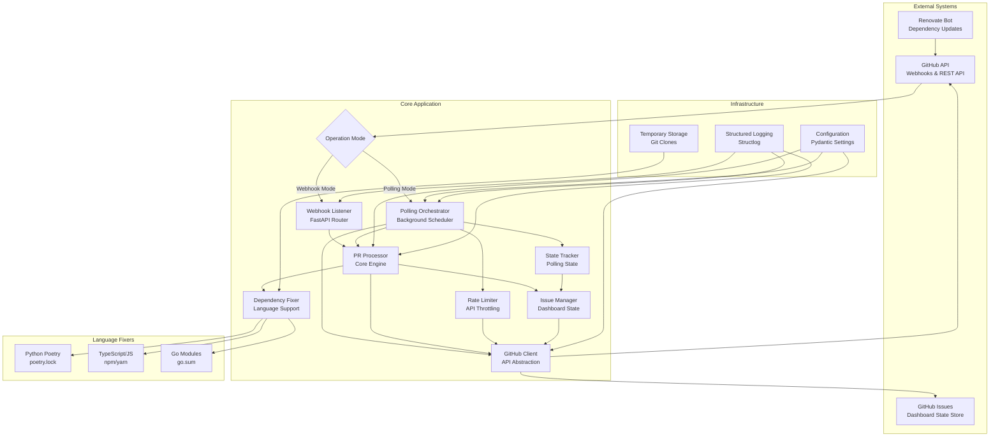
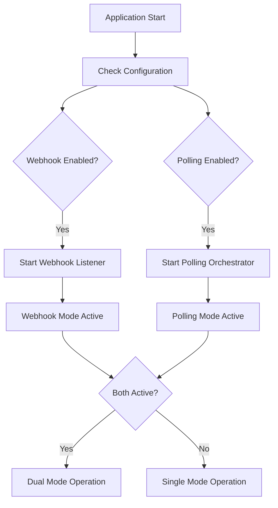
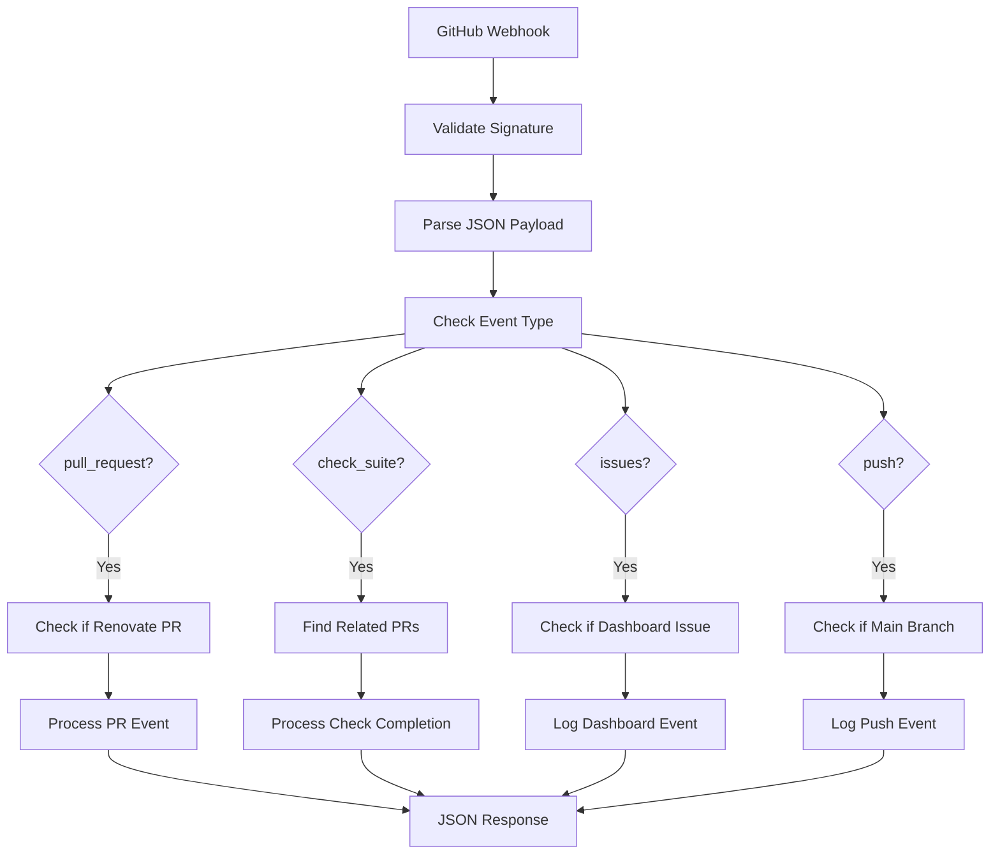
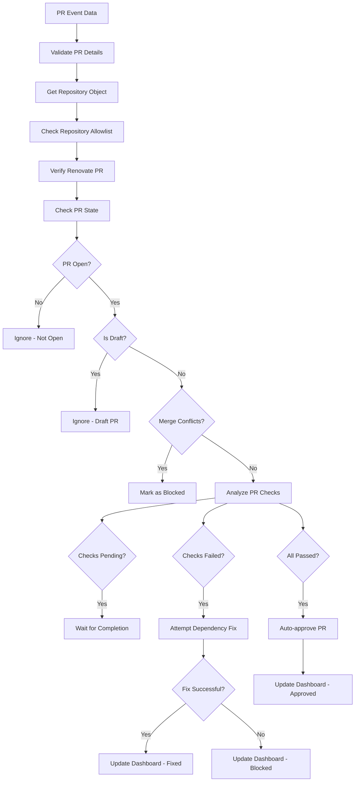
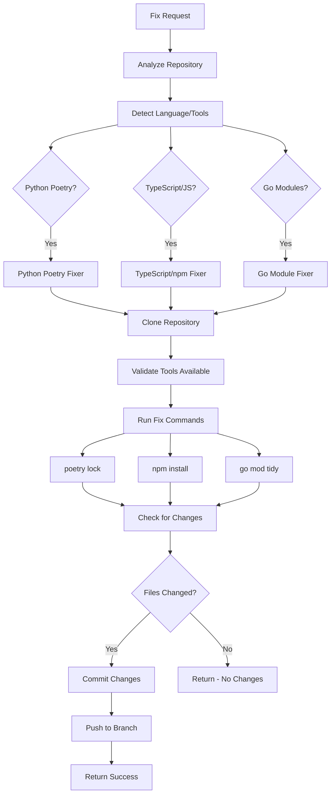
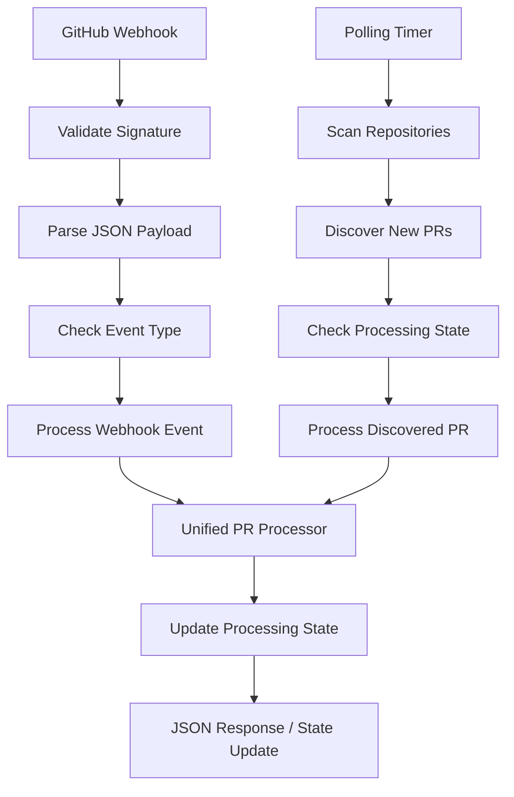
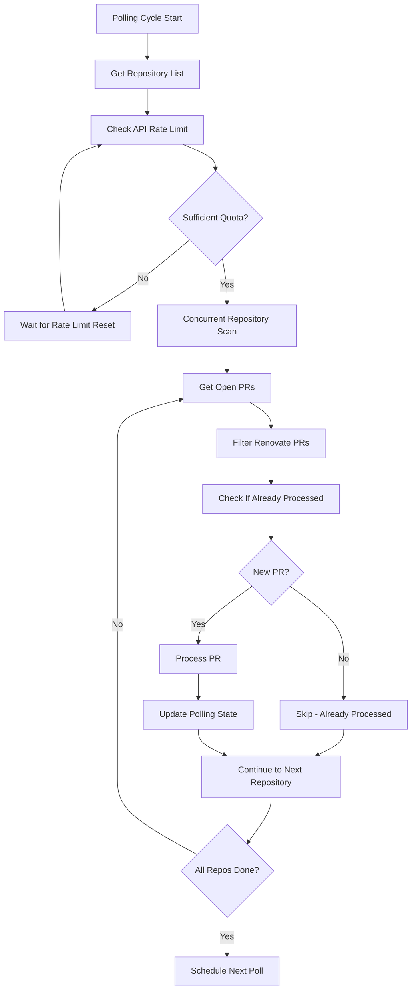
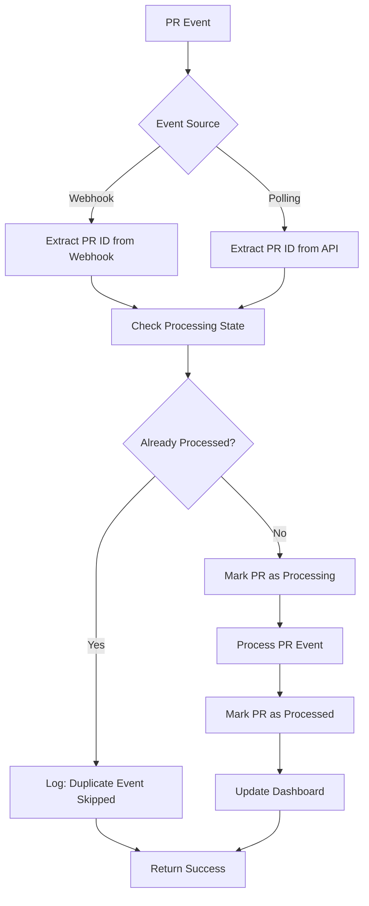

# RenovateAgent System Architecture

## Overview

RenovateAgent is an intelligent automation system that streamlines dependency management by automatically reviewing and managing [Renovate](https://github.com/renovatebot/renovate) pull requests across GitHub organizations. The system follows a **stateless architecture** with GitHub Issues as the sole state store, supporting both **webhook-driven** and **polling-based** operation modes for maximum deployment flexibility, focusing on automated PR approval, dependency fixing, and repository health monitoring to reduce manual intervention in dependency updates.

**Last Updated**: 2025-07-09
**Version**: Current Architecture v0.5.0 (Dual-Mode Operation)

## System Architecture



## Dual-Mode Operation

### Operation Modes

The system supports two operation modes that can run independently or simultaneously:

#### 1. Webhook Mode (Push-Based)
- **Trigger**: GitHub webhooks pushed to the application
- **Latency**: Real-time (immediate processing)
- **Requirements**: Inbound network connectivity, webhook configuration
- **Use Cases**: Traditional deployments with public endpoints

#### 2. Polling Mode (Pull-Based)
- **Trigger**: Periodic GitHub API queries
- **Latency**: 2-5 minutes (configurable)
- **Requirements**: Outbound network connectivity only
- **Use Cases**: Corporate firewalls, private networks, development environments

#### 3. Dual Mode (Hybrid)
- **Configuration**: Both modes enabled simultaneously
- **Redundancy**: Multiple triggers for the same events
- **Deduplication**: State tracking prevents duplicate processing
- **Benefits**: Maximum reliability and deployment flexibility

### Mode Selection



## Polling System Architecture

### Polling Orchestrator

**Purpose**: Manages periodic repository scanning and PR discovery through GitHub API queries.

**Key Components**:
- **Background Scheduler**: Asyncio-based task management
- **Repository Iterator**: Concurrent repository processing
- **Rate Limit Integration**: GitHub API quota management
- **State Coordination**: Integration with existing state tracking

**Key Methods**:
- `start_polling()` - Initialize background polling tasks
- `stop_polling()` - Graceful shutdown of polling operations
- `_poll_repositories()` - Main polling loop for repository scanning
- `_process_repository_prs()` - Discover and process new PRs
- `_should_process_pr()` - Determine if PR needs processing

**Concurrency Model**:
```python
# Concurrent repository processing
async with asyncio.TaskGroup() as tg:
    for repo in repositories:
        tg.create_task(self._process_repository_prs(repo))
```

### Polling State Tracker

**Purpose**: Extends the existing Issue Manager to track polling-specific state and prevent duplicate processing.

**State Management**:
- **Last Poll Timestamps**: Track when repositories were last checked
- **PR Processing History**: Remember processed PRs to prevent duplicates
- **Polling Metadata**: Store polling configuration and status
- **Dashboard Integration**: Extend existing GitHub Issues dashboard

**Key Methods**:
- `update_polling_state()` - Record polling activity
- `should_process_pr()` - Check if PR already processed
- `get_last_poll_time()` - Retrieve last polling timestamp
- `update_dashboard_polling_info()` - Add polling status to dashboard

**Dashboard Enhancements**:
```json
{
  "polling": {
    "enabled": true,
    "last_poll": "2025-07-09T10:30:00Z",
    "interval_minutes": 2,
    "processed_prs": ["123", "124", "125"]
  }
}
```

### Rate Limiter

**Purpose**: Monitor and respect GitHub API rate limits to prevent quota exhaustion during polling operations.

**Rate Limit Management**:
- **Quota Monitoring**: Track remaining API calls
- **Intelligent Throttling**: Adjust polling frequency based on quota
- **Burst Protection**: Prevent rapid API consumption
- **Recovery Handling**: Automatic backoff on rate limit hits

**Key Methods**:
- `check_rate_limit()` - Verify API quota availability
- `wait_if_needed()` - Implement intelligent backoff
- `get_reset_time()` - Calculate rate limit reset timing
- `should_throttle()` - Determine if throttling needed

**Throttling Strategy**:
```python
# Adaptive polling based on rate limits
if remaining_calls < (repositories * 5):  # 5 calls per repo minimum
    await self._wait_for_rate_limit_reset()
```

## Stateless Architecture Principles

### Design Philosophy
- **No Persistent Application State**: All state is maintained in GitHub Issues
- **Ephemeral Processing**: Each webhook event is processed independently
- **Temporary Resources**: Repository clones are created and cleaned up per operation
- **External State Store**: GitHub Issues serve as the dashboard and state persistence layer

### Benefits
- **Horizontal Scalability**: Multiple instances can run without coordination
- **Simple Deployment**: No database setup or maintenance required
- **Reliability**: No risk of data corruption or migration issues
- **Cost Effective**: Minimal infrastructure requirements
- **GitHub Native**: All data remains within GitHub ecosystem

## Data Flow

### 1. Webhook Processing Flow



### 2. PR Analysis and Decision Flow



### 3. Dependency Fixing Workflow



## Component Details

### Webhook Listener

**Purpose**: Receives and validates GitHub webhook events, routing them to appropriate processors.

**Key Methods**:
- `handle_github_webhook()` - Main webhook endpoint handler
- `_validate_signature()` - HMAC signature validation
- `_process_event()` - Event type routing
- `_process_pull_request_event()` - PR event processing
- `_process_check_suite_event()` - Check suite completion handling

**Security Features**:
- HMAC SHA-256 signature validation
- Development mode bypass for testing
- Rate limiting protection
- Input validation and sanitization

**Supported Events**:
- `pull_request` (opened, synchronize, reopened, ready_for_review)
- `check_suite` (completed)
- `issues` (for dashboard management)
- `push` (main branch monitoring)

### PR Processor

**Purpose**: Core decision engine for analyzing and processing Renovate PRs.

**Key Methods**:
- `process_pr_event()` - Main PR processing logic
- `process_check_suite_completion()` - Handle check completion
- `_process_pr_for_approval()` - PR approval analysis
- `_analyze_pr_checks()` - Check status analysis
- `_attempt_dependency_fix()` - Trigger dependency fixing

**Decision Logic**:
1. **Validation**: Verify PR is from Renovate bot
2. **State Checks**: Ensure PR is open, not draft, no conflicts
3. **Check Analysis**: Evaluate CI/CD check status
4. **Action Determination**: Approve, fix dependencies, or block
5. **Dashboard Updates**: Maintain repository health status

### GitHub Client

**Purpose**: Robust GitHub API client with authentication, rate limiting, and error handling.

**Authentication Modes**:
- **GitHub App**: Production mode with JWT and installation tokens
- **Personal Access Token**: Development mode for testing

**Key Methods**:
- `_authenticate()` - Handle GitHub App or PAT authentication
- `get_repo()` - Repository object retrieval
- `get_pr()` - Pull request object retrieval
- `is_renovate_pr()` - Renovate bot detection
- `approve_pr()` - PR approval with review
- `commit_file()` - File updates and commits

**Rate Limiting**:
- Automatic rate limit detection and respect
- Exponential backoff on rate limit hits
- Rate limit status monitoring and logging

### Dependency Fixer Factory

**Purpose**: Language detection and appropriate dependency fixer selection.

**Supported Languages**:
- **Python**: Poetry package manager (`poetry.lock`)
- **TypeScript/JavaScript**: npm/yarn package managers (`package-lock.json`, `yarn.lock`)
- **Go**: Go modules (`go.sum`)

**Selection Logic**:
1. **Repository Analysis**: Scan for language-specific files
2. **Tool Detection**: Identify package managers and build tools
3. **Fixer Matching**: Select appropriate language-specific fixer
4. **Tool Validation**: Ensure required tools are available

### Language-Specific Fixers

#### Python Poetry Fixer
- **Detection**: `pyproject.toml` with `[tool.poetry]` section
- **Commands**: `poetry lock --no-update`, `poetry install`
- **Lock Files**: `poetry.lock`
- **Validation**: Poetry CLI availability check

#### TypeScript/JavaScript npm Fixer
- **Detection**: `package.json` presence
- **Package Manager**: Auto-detect npm vs yarn by lock files
- **Commands**: `npm install` / `npm ci` or `yarn install`
- **Lock Files**: `package-lock.json`, `yarn.lock`
- **Validation**: npm/yarn CLI availability check

#### Go Module Fixer
- **Detection**: `go.mod` with valid module declaration
- **Commands**: `go mod tidy`, `go mod download`
- **Lock Files**: `go.sum`
- **Validation**: Go CLI availability check

### Issue State Manager

**Purpose**: Maintains repository health dashboards through GitHub issues.

**Dashboard Features**:
- **Structured Data**: JSON data in HTML comments
- **Human-Readable Reports**: Markdown tables and status
- **Real-time Updates**: PR status tracking
- **Historical Data**: Recently processed PRs
- **Statistics**: Success rates and metrics

**Key Methods**:
- `get_or_create_dashboard_issue()` - Dashboard issue management
- `update_dashboard_issue()` - Status updates
- `_collect_repository_data()` - Repository health data
- `_generate_human_readable_report()` - Markdown report generation

## Configuration System

### Environment Variables

**GitHub Authentication**:
```bash
# Production (GitHub App)
GITHUB_APP_ID=123456
GITHUB_APP_PRIVATE_KEY_PATH=/path/to/private-key.pem
GITHUB_WEBHOOK_SECRET=your-webhook-secret

# Development (Personal Access Token)
GITHUB_APP_ID=0
GITHUB_PERSONAL_ACCESS_TOKEN=ghp_your-token
```

**Operation Mode Configuration**:
```bash
# Webhook Mode (default for production)
ENABLE_WEBHOOKS=true
HOST=0.0.0.0
PORT=8000

# Polling Mode (default for local development)
ENABLE_POLLING=true
POLLING_INTERVAL_MINUTES=2
POLLING_REPOSITORIES=org/repo1,org/repo2

# Dual Mode (both enabled)
ENABLE_WEBHOOKS=true
ENABLE_POLLING=true
```

**Repository Management**:
```bash
GITHUB_ORGANIZATION=your-organization
GITHUB_REPOSITORY_ALLOWLIST=repo1,repo2,repo3  # Optional filtering
GITHUB_TEST_REPOSITORIES=org/test-repo1,org/test-repo2

# Polling-specific repository configuration
POLLING_REPOSITORIES=org/repo1,org/repo2  # Specific repos for polling
# If not set, uses GITHUB_TEST_REPOSITORIES or discovers automatically
```

**Polling Configuration**:
```bash
# Polling behavior
POLLING_INTERVAL_MINUTES=2                    # How often to check repositories
POLLING_MAX_CONCURRENT_REPOS=5                # Concurrent repository processing
POLLING_RATE_LIMIT_BUFFER=1000               # API calls to reserve
POLLING_ENABLE_ADAPTIVE_INTERVAL=true        # Adjust interval based on activity

# Rate limiting
GITHUB_API_RATE_LIMIT=5000                   # API calls per hour
POLLING_RATE_LIMIT_THRESHOLD=0.8             # Throttle at 80% usage
```

**Dependency Fixing**:
```bash
ENABLE_DEPENDENCY_FIXING=true
SUPPORTED_LANGUAGES=python,typescript,go
CLONE_TIMEOUT=300
DEPENDENCY_UPDATE_TIMEOUT=600
```

**Server Configuration**:
```bash
HOST=0.0.0.0
PORT=8000
DEBUG=false
LOG_LEVEL=INFO
LOG_FORMAT=json
```

### Configuration Validation

- **Mode Validation**: Ensure at least one operation mode is enabled
- **Polling Configuration**: Validate interval settings and repository lists
- **Rate Limit Settings**: Ensure polling respects API quotas
- **Field Validation**: Pydantic-based configuration validation
- **Environment Loading**: Automatic `.env` file loading
- **Type Conversion**: String-to-list conversion for comma-separated values
- **Default Values**: Sensible defaults for all settings
- **Development Mode**: Automatic detection based on authentication method

## Data Flow

### 1. Dual-Mode Event Processing



### 2. Polling Discovery Flow



### 3. State Deduplication Flow



## Performance Characteristics

### Webhook Processing Performance

- **Simple Events**: 50-100ms response time
- **PR Analysis**: 200-500ms for status checks
- **Dependency Fixing**: 30-180 seconds (depends on repository size)
- **Dashboard Updates**: 300-800ms for GitHub Issue updates

### Polling Processing Performance

- **Repository Scan**: 100-300ms per repository (API dependent)
- **PR Discovery**: 50-150ms per repository with open PRs
- **Concurrent Processing**: 5 repositories processed simultaneously
- **Full Polling Cycle**: 30-60 seconds for 10 repositories
- **Adaptive Intervals**: 2-5 minutes based on activity and rate limits

### GitHub API Usage

#### Webhook Mode
- **Rate Limit Usage**: Event-driven, minimal API consumption
- **Typical Usage**: 50-200 API calls per day for active repositories
- **Burst Patterns**: High usage during dependency update waves

#### Polling Mode
- **Rate Limit Usage**: Continuous API consumption
- **Typical Usage**: 15,000-36,000 API calls per day (2-minute intervals)
- **Per Repository**: ~3-5 API calls per polling cycle
- **Quota Management**: Intelligent throttling to respect rate limits

#### Dual Mode
- **Combined Usage**: Webhook burst + polling baseline
- **Deduplication**: No duplicate processing overhead
- **Efficiency**: Best of both modes without redundant API calls

### Resource Usage

- **Memory**: 50-100MB baseline, 200-500MB during dependency fixing
- **CPU**: Low baseline, moderate during concurrent polling, high during git operations
- **Disk**: Temporary repository clones (cleaned up automatically)
- **Network**: GitHub API calls and git operations
- **Storage**: No persistent storage required - fully stateless

## Security Architecture

### Authentication Security

- **GitHub App**: Secure JWT-based authentication with short-lived tokens
- **Private Key**: Secure storage and access to GitHub App private keys
- **Webhook Validation**: HMAC SHA-256 signature verification
- **Token Rotation**: Automatic installation token refresh

### Input Validation

- **Webhook Signatures**: Cryptographic validation of all incoming webhooks
- **JSON Parsing**: Safe JSON parsing with error handling
- **Parameter Validation**: Pydantic-based input validation
- **Repository Filtering**: Allowlist-based repository access control

### Operational Security

- **Temporary Files**: Secure temporary directory usage
- **Git Operations**: Isolated repository clones with cleanup
- **Error Handling**: No sensitive data in error messages
- **Logging**: Structured logging without sensitive information

## Deployment Considerations

### Container Deployment

**Docker Configuration**:
```dockerfile
FROM python:3.13-slim
WORKDIR /app
COPY pyproject.toml poetry.lock ./
RUN pip install poetry && poetry install --only=main --no-root
COPY src/ ./src/
RUN poetry install --only-root
EXPOSE 8000
CMD ["python", "-m", "renovate_agent.main"]
```

**Docker Compose (Dual Mode)**:
```yaml
version: '3.8'
services:
  renovate-agent:
    build: .
    ports:
      - "8000:8000"
    environment:
      # Authentication
      - GITHUB_APP_ID=${GITHUB_APP_ID:-0}
      - GITHUB_PERSONAL_ACCESS_TOKEN=${GITHUB_PERSONAL_ACCESS_TOKEN}
      - GITHUB_ORGANIZATION=${GITHUB_ORGANIZATION}
      - GITHUB_WEBHOOK_SECRET=${GITHUB_WEBHOOK_SECRET}
      
      # Operation modes
      - ENABLE_WEBHOOKS=${ENABLE_WEBHOOKS:-true}
      - ENABLE_POLLING=${ENABLE_POLLING:-true}
      - POLLING_INTERVAL_MINUTES=${POLLING_INTERVAL_MINUTES:-2}
      
      # Repository configuration
      - POLLING_REPOSITORIES=${POLLING_REPOSITORIES}
    volumes:
      - ./config/private-key.pem:/app/private-key.pem:ro
      - ./logs:/app/logs
    healthcheck:
      test: ["CMD", "curl", "-f", "http://localhost:8000/health"]
      interval: 30s
      timeout: 10s
      retries: 3
```

### Production Requirements

#### Webhook Mode Production
- **Public Endpoint**: Accessible URL for GitHub webhooks
- **TLS/SSL**: Required for webhook security
- **Reverse Proxy**: Nginx or similar for SSL termination
- **Firewall**: Inbound connectivity on webhook port

#### Polling Mode Production
- **Outbound Only**: No inbound connectivity required
- **Private Networks**: Works behind corporate firewalls
- **VPN Deployment**: Suitable for private cloud deployments
- **API Quotas**: Monitor GitHub API usage

#### Dual Mode Production
- **Best of Both**: Maximum reliability and flexibility
- **Redundancy**: Multiple event sources
- **Complexity**: Slightly higher operational overhead

### Scaling Considerations

#### Webhook Mode Scaling
- **Horizontal Scaling**: Multiple stateless instances behind load balancer
- **Event Distribution**: Webhooks distributed across instances
- **Instant Scaling**: Immediate response to webhook volume

#### Polling Mode Scaling
- **Repository Partitioning**: Distribute repositories across instances
- **Coordinated Polling**: Prevent duplicate processing
- **Resource-Based Scaling**: Scale based on repository count

#### GitHub API Limits
- **Primary Constraint**: API rate limits affect both modes
- **Per-Installation Limits**: 5,000 calls per hour for GitHub Apps
- **Efficient Usage**: Minimize API calls through intelligent caching
- **Quota Distribution**: Share quotas across polling instances

### High Availability Setup

```yaml
# Kubernetes deployment example (Dual Mode)
apiVersion: apps/v1
kind: Deployment
metadata:
  name: renovate-agent
spec:
  replicas: 3
  selector:
    matchLabels:
      app: renovate-agent
  template:
    metadata:
      labels:
        app: renovate-agent
    spec:
      containers:
      - name: renovate-agent
        image: renovate-agent:0.5.0
        ports:
        - containerPort: 8000
        env:
        - name: GITHUB_ORGANIZATION
          value: "your-org"
        - name: ENABLE_WEBHOOKS
          value: "true"
        - name: ENABLE_POLLING
          value: "true"
        - name: POLLING_INTERVAL_MINUTES
          value: "2"
        livenessProbe:
          httpGet:
            path: /health
            port: 8000
          initialDelaySeconds: 30
          periodSeconds: 10
        readinessProbe:
          httpGet:
            path: /health
            port: 8000
          initialDelaySeconds: 5
          periodSeconds: 5
```

## Error Handling and Resilience

### Error Categories

1. **GitHub API Errors**: Rate limiting, authentication, network issues
2. **Dependency Fixing Errors**: Tool failures, compilation errors, conflicts
3. **Configuration Errors**: Missing settings, invalid values
4. **Temporary Resource Errors**: Git operations, file system issues

### Recovery Strategies

- **Stateless Recovery**: Each request is independent, no state corruption risk
- **Exponential Backoff**: Automatic retry with increasing delays for GitHub API
- **Circuit Breaker**: Temporary service degradation on repeated failures
- **Graceful Degradation**: Continue operation with reduced functionality
- **Manual Intervention**: Clear error reporting through GitHub Issue updates

### Monitoring and Alerting

- **Health Endpoints**: `/health` for application status
- **Metrics Collection**: PR processing rates, success rates, API usage
- **Error Tracking**: Structured error logging with context
- **Dashboard Monitoring**: GitHub Issues contain real-time health status
- **GitHub API Monitoring**: Rate limit usage and quota tracking

## Architecture Benefits

### Deployment Flexibility

- **Network Adaptability**: Works in any network environment
- **Webhook Mode**: Traditional deployments with public endpoints
- **Polling Mode**: Corporate firewalls and private networks
- **Dual Mode**: Maximum reliability with redundant event sources
- **Simple Migration**: Easy transition between modes

### Automation Efficiency

- **Reduced Manual Work**: Automatic PR approval for passing checks
- **Fast Dependency Resolution**: Automated lock file updates
- **Real-time Monitoring**: GitHub Issues provide instant visibility
- **Scalable Processing**: Handle multiple repositories simultaneously
- **Mode Flexibility**: Choose optimal mode for environment

### Reliability and Safety

- **Stateless Reliability**: No persistent state to corrupt or lose
- **Conservative Approval**: Only approve PRs with all checks passing
- **Automatic Cleanup**: Temporary resources cleaned up after each operation
- **Audit Trail**: Complete logging and GitHub Issue history
- **Security First**: Cryptographic validation of all inputs
- **Redundant Processing**: Dual mode provides backup event sources

### Developer Experience

- **GitHub Native**: All monitoring and state within familiar GitHub interface
- **No Database Management**: Eliminates database administration overhead
- **Simple Deployment**: Single container with minimal configuration
- **Easy Debugging**: All state visible in GitHub Issues and structured logs
- **Cost Effective**: No additional infrastructure costs for databases or caches
- **Local Development**: Polling mode perfect for local testing

### Operational Simplicity

- **Infrastructure Minimal**: Only the application container required
- **No Migrations**: No database schema changes or data migrations
- **Backup Free**: No application data to backup (GitHub provides persistence)
- **Disaster Recovery**: Simply redeploy container with same configuration
- **Development Parity**: Local development identical to production environment
- **Network Flexibility**: Adapts to any network security requirements
