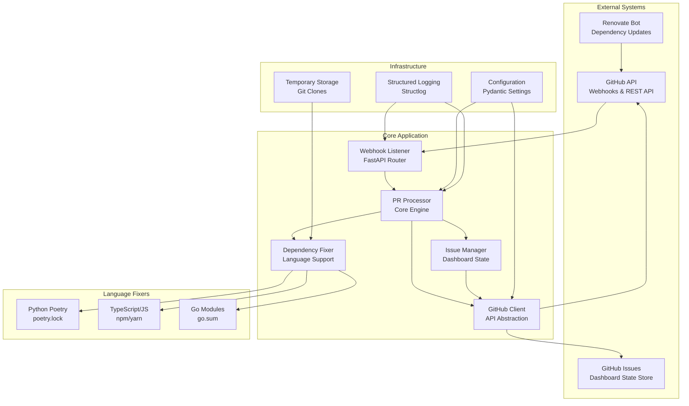

# RenovateAgent System Architecture

## Overview

RenovateAgent is an intelligent automation system that streamlines dependency management by automatically reviewing and managing [Renovate](https://github.com/renovatebot/renovate) pull requests across GitHub organizations. The system follows a **stateless architecture** with GitHub Issues as the sole state store, focusing on automated PR approval, dependency fixing, and repository health monitoring to reduce manual intervention in dependency updates.

**Last Updated**: 2025-01-09
**Version**: Current Architecture v0.4.0

## System Architecture



## Stateless Architecture Principles

### Design Philosophy
- **No Persistent Application State**: All state is maintained in GitHub Issues
- **Ephemeral Processing**: Each webhook event is processed independently
- **Temporary Resources**: Repository clones are created and cleaned up per operation
- **External State Store**: GitHub Issues serve as the dashboard and state persistence layer

### Benefits
- **Horizontal Scalability**: Multiple instances can run without coordination
- **Simple Deployment**: No database setup or maintenance required
- **Reliability**: No risk of data corruption or migration issues
- **Cost Effective**: Minimal infrastructure requirements
- **GitHub Native**: All data remains within GitHub ecosystem

## Data Flow

### 1. Webhook Processing Flow


### 2. PR Analysis and Decision Flow


### 3. Dependency Fixing Workflow


## Component Details

### Webhook Listener

**Purpose**: Receives and validates GitHub webhook events, routing them to appropriate processors.

**Key Methods**:
- `handle_github_webhook()` - Main webhook endpoint handler
- `_validate_signature()` - HMAC signature validation
- `_process_event()` - Event type routing
- `_process_pull_request_event()` - PR event processing
- `_process_check_suite_event()` - Check suite completion handling

**Security Features**:
- HMAC SHA-256 signature validation
- Development mode bypass for testing
- Rate limiting protection
- Input validation and sanitization

**Supported Events**:
- `pull_request` (opened, synchronize, reopened, ready_for_review)
- `check_suite` (completed)
- `issues` (for dashboard management)
- `push` (main branch monitoring)

### PR Processor

**Purpose**: Core decision engine for analyzing and processing Renovate PRs.

**Key Methods**:
- `process_pr_event()` - Main PR processing logic
- `process_check_suite_completion()` - Handle check completion
- `_process_pr_for_approval()` - PR approval analysis
- `_analyze_pr_checks()` - Check status analysis
- `_attempt_dependency_fix()` - Trigger dependency fixing

**Decision Logic**:
1. **Validation**: Verify PR is from Renovate bot
2. **State Checks**: Ensure PR is open, not draft, no conflicts
3. **Check Analysis**: Evaluate CI/CD check status
4. **Action Determination**: Approve, fix dependencies, or block
5. **Dashboard Updates**: Maintain repository health status

### GitHub Client

**Purpose**: Robust GitHub API client with authentication, rate limiting, and error handling.

**Authentication Modes**:
- **GitHub App**: Production mode with JWT and installation tokens
- **Personal Access Token**: Development mode for testing

**Key Methods**:
- `_authenticate()` - Handle GitHub App or PAT authentication
- `get_repo()` - Repository object retrieval
- `get_pr()` - Pull request object retrieval
- `is_renovate_pr()` - Renovate bot detection
- `approve_pr()` - PR approval with review
- `commit_file()` - File updates and commits

**Rate Limiting**:
- Automatic rate limit detection and respect
- Exponential backoff on rate limit hits
- Rate limit status monitoring and logging

### Dependency Fixer Factory

**Purpose**: Language detection and appropriate dependency fixer selection.

**Supported Languages**:
- **Python**: Poetry package manager (`poetry.lock`)
- **TypeScript/JavaScript**: npm/yarn package managers (`package-lock.json`, `yarn.lock`)
- **Go**: Go modules (`go.sum`)

**Selection Logic**:
1. **Repository Analysis**: Scan for language-specific files
2. **Tool Detection**: Identify package managers and build tools
3. **Fixer Matching**: Select appropriate language-specific fixer
4. **Tool Validation**: Ensure required tools are available

### Language-Specific Fixers

#### Python Poetry Fixer
- **Detection**: `pyproject.toml` with `[tool.poetry]` section
- **Commands**: `poetry lock --no-update`, `poetry install`
- **Lock Files**: `poetry.lock`
- **Validation**: Poetry CLI availability check

#### TypeScript/JavaScript npm Fixer
- **Detection**: `package.json` presence
- **Package Manager**: Auto-detect npm vs yarn by lock files
- **Commands**: `npm install` / `npm ci` or `yarn install`
- **Lock Files**: `package-lock.json`, `yarn.lock`
- **Validation**: npm/yarn CLI availability check

#### Go Module Fixer
- **Detection**: `go.mod` with valid module declaration
- **Commands**: `go mod tidy`, `go mod download`
- **Lock Files**: `go.sum`
- **Validation**: Go CLI availability check

### Issue State Manager

**Purpose**: Maintains repository health dashboards through GitHub issues.

**Dashboard Features**:
- **Structured Data**: JSON data in HTML comments
- **Human-Readable Reports**: Markdown tables and status
- **Real-time Updates**: PR status tracking
- **Historical Data**: Recently processed PRs
- **Statistics**: Success rates and metrics

**Key Methods**:
- `get_or_create_dashboard_issue()` - Dashboard issue management
- `update_dashboard_issue()` - Status updates
- `_collect_repository_data()` - Repository health data
- `_generate_human_readable_report()` - Markdown report generation

## Configuration System

### Environment Variables

**GitHub Authentication**:
```bash
# Production (GitHub App)
GITHUB_APP_ID=123456
GITHUB_APP_PRIVATE_KEY_PATH=/path/to/private-key.pem
GITHUB_WEBHOOK_SECRET=your-webhook-secret

# Development (Personal Access Token)
GITHUB_APP_ID=0
GITHUB_PERSONAL_ACCESS_TOKEN=ghp_your-token
```

**Repository Management**:
```bash
GITHUB_ORGANIZATION=your-organization
GITHUB_REPOSITORY_ALLOWLIST=repo1,repo2,repo3  # Optional filtering
GITHUB_TEST_REPOSITORIES=org/test-repo1,org/test-repo2
```

**Dependency Fixing**:
```bash
ENABLE_DEPENDENCY_FIXING=true
SUPPORTED_LANGUAGES=python,typescript,go
CLONE_TIMEOUT=300
DEPENDENCY_UPDATE_TIMEOUT=600
```

**Server Configuration**:
```bash
HOST=0.0.0.0
PORT=8000
DEBUG=false
LOG_LEVEL=INFO
LOG_FORMAT=json
```

### Configuration Validation

- **Field Validation**: Pydantic-based configuration validation
- **Environment Loading**: Automatic `.env` file loading
- **Type Conversion**: String-to-list conversion for comma-separated values
- **Default Values**: Sensible defaults for all settings
- **Development Mode**: Automatic detection based on authentication method

## Performance Characteristics

### Webhook Processing Performance

- **Simple Events**: 50-100ms response time
- **PR Analysis**: 200-500ms for status checks
- **Dependency Fixing**: 30-180 seconds (depends on repository size)
- **Dashboard Updates**: 300-800ms for GitHub Issue updates

### GitHub API Usage

- **Rate Limit Awareness**: Automatic detection and respect
- **Efficient Calls**: Minimize API calls through intelligent caching
- **State Management**: GitHub Issues as persistent state store
- **Error Handling**: Graceful degradation on API failures

### Resource Usage

- **Memory**: 50-100MB baseline, 200-500MB during dependency fixing
- **CPU**: Low baseline, high during git operations and dependency resolution
- **Disk**: Temporary repository clones (cleaned up automatically)
- **Network**: GitHub API calls and git operations
- **Storage**: No persistent storage required - fully stateless

## Security Architecture

### Authentication Security

- **GitHub App**: Secure JWT-based authentication with short-lived tokens
- **Private Key**: Secure storage and access to GitHub App private keys
- **Webhook Validation**: HMAC SHA-256 signature verification
- **Token Rotation**: Automatic installation token refresh

### Input Validation

- **Webhook Signatures**: Cryptographic validation of all incoming webhooks
- **JSON Parsing**: Safe JSON parsing with error handling
- **Parameter Validation**: Pydantic-based input validation
- **Repository Filtering**: Allowlist-based repository access control

### Operational Security

- **Temporary Files**: Secure temporary directory usage
- **Git Operations**: Isolated repository clones with cleanup
- **Error Handling**: No sensitive data in error messages
- **Logging**: Structured logging without sensitive information

## Deployment Considerations

### Container Deployment

**Docker Configuration**:
```dockerfile
FROM python:3.13-slim
WORKDIR /app
COPY pyproject.toml poetry.lock ./
RUN pip install poetry && poetry install --only=main --no-root
COPY src/ ./src/
RUN poetry install --only-root
EXPOSE 8000
CMD ["python", "-m", "renovate_agent.main"]
```

**Docker Compose (Simplified)**:
```yaml
version: '3.8'
services:
  renovate-agent:
    build: .
    ports:
      - "8000:8000"
    environment:
      - GITHUB_APP_ID=${GITHUB_APP_ID:-0}
      - GITHUB_PERSONAL_ACCESS_TOKEN=${GITHUB_PERSONAL_ACCESS_TOKEN}
      - GITHUB_ORGANIZATION=${GITHUB_ORGANIZATION}
      - GITHUB_WEBHOOK_SECRET=${GITHUB_WEBHOOK_SECRET}
    volumes:
      - ./config/private-key.pem:/app/private-key.pem:ro
      - ./logs:/app/logs
```

### Production Requirements

- **Reverse Proxy**: Nginx or similar for SSL/TLS termination and load balancing
- **Health Monitoring**: Built-in `/health` endpoint for load balancer checks
- **Logging**: Centralized log aggregation (JSON structured logs)
- **Secrets Management**: Secure GitHub App private key and webhook secret storage
- **Container Orchestration**: Kubernetes or Docker Swarm for high availability

### Scaling Considerations

- **Horizontal Scaling**: Multiple stateless instances behind load balancer
- **No Database**: Eliminates database bottlenecks and complexity
- **GitHub API Limits**: Primary scaling constraint is GitHub API rate limits
- **Resource Isolation**: Each instance operates independently
- **Auto-scaling**: Can scale based on webhook volume and CPU usage

### High Availability Setup

```yaml
# Kubernetes deployment example
apiVersion: apps/v1
kind: Deployment
metadata:
  name: renovate-agent
spec:
  replicas: 3
  selector:
    matchLabels:
      app: renovate-agent
  template:
    metadata:
      labels:
        app: renovate-agent
    spec:
      containers:
      - name: renovate-agent
        image: renovate-agent:0.4.0
        ports:
        - containerPort: 8000
        env:
        - name: GITHUB_ORGANIZATION
          value: "your-org"
        livenessProbe:
          httpGet:
            path: /health
            port: 8000
          initialDelaySeconds: 30
          periodSeconds: 10
```

## Error Handling and Resilience

### Error Categories

1. **GitHub API Errors**: Rate limiting, authentication, network issues
2. **Dependency Fixing Errors**: Tool failures, compilation errors, conflicts
3. **Configuration Errors**: Missing settings, invalid values
4. **Temporary Resource Errors**: Git operations, file system issues

### Recovery Strategies

- **Stateless Recovery**: Each request is independent, no state corruption risk
- **Exponential Backoff**: Automatic retry with increasing delays for GitHub API
- **Circuit Breaker**: Temporary service degradation on repeated failures
- **Graceful Degradation**: Continue operation with reduced functionality
- **Manual Intervention**: Clear error reporting through GitHub Issue updates

### Monitoring and Alerting

- **Health Endpoints**: `/health` for application status
- **Metrics Collection**: PR processing rates, success rates, API usage
- **Error Tracking**: Structured error logging with context
- **Dashboard Monitoring**: GitHub Issues contain real-time health status
- **GitHub API Monitoring**: Rate limit usage and quota tracking

## Architecture Benefits

### Automation Efficiency

- **Reduced Manual Work**: Automatic PR approval for passing checks
- **Fast Dependency Resolution**: Automated lock file updates
- **Real-time Monitoring**: GitHub Issues provide instant visibility
- **Scalable Processing**: Handle multiple repositories simultaneously

### Reliability and Safety

- **Stateless Reliability**: No persistent state to corrupt or lose
- **Conservative Approval**: Only approve PRs with all checks passing
- **Automatic Cleanup**: Temporary resources cleaned up after each operation
- **Audit Trail**: Complete logging and GitHub Issue history
- **Security First**: Cryptographic validation of all inputs

### Developer Experience

- **GitHub Native**: All monitoring and state within familiar GitHub interface
- **No Database Management**: Eliminates database administration overhead
- **Simple Deployment**: Single container with minimal configuration
- **Easy Debugging**: All state visible in GitHub Issues and structured logs
- **Cost Effective**: No additional infrastructure costs for databases or caches

### Operational Simplicity

- **Infrastructure Minimal**: Only the application container required
- **No Migrations**: No database schema changes or data migrations
- **Backup Free**: No application data to backup (GitHub provides persistence)
- **Disaster Recovery**: Simply redeploy container with same configuration
- **Development Parity**: Local development identical to production environment
