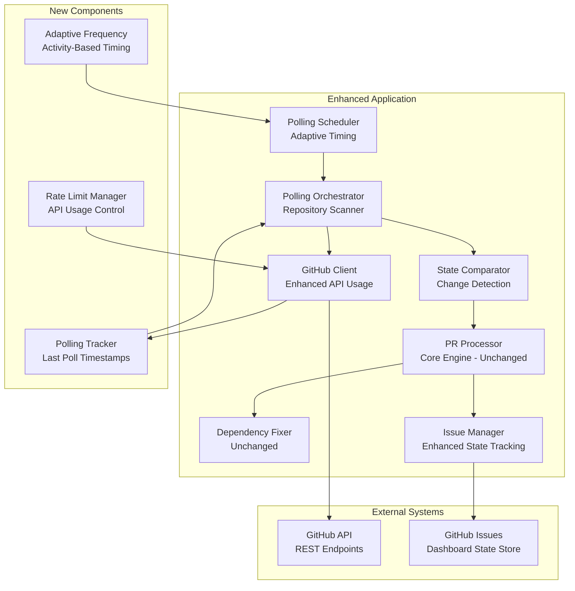
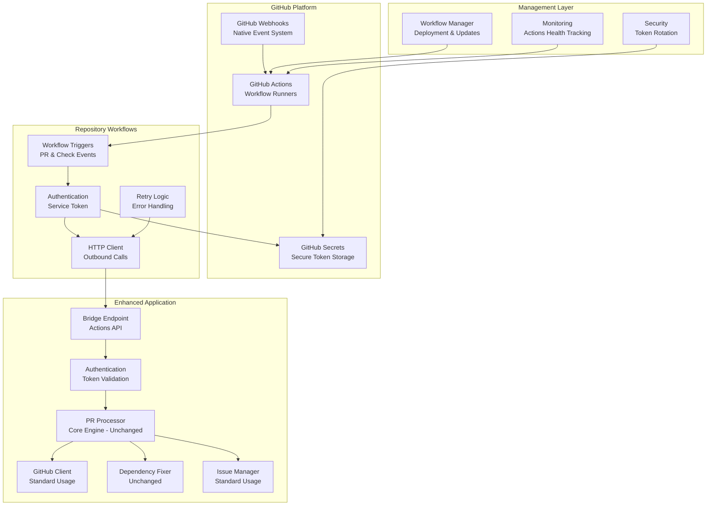

# RenovateAgent Architecture Improvements: Non-Webhook Alternatives

**Document Version:** 1.0
**Last Updated:** 2025-07-09
**Status:** Architecture Planning

## Executive Summary

This document analyzes alternative architectures for RenovateAgent that eliminate the dependency on GitHub webhooks, enabling deployment in environments where GitHub cannot reach the service (corporate firewalls, private networks, air-gapped environments).

### Problem Statement

The current webhook-based architecture requires:
- Inbound network access from GitHub to the service
- Publicly accessible endpoints with proper firewall configuration
- Real-time webhook delivery reliability

These requirements prevent deployment in many enterprise environments where:
- Services run behind corporate firewalls without inbound access
- Security policies prohibit exposing internal services to external networks
- Network architecture uses NAT/proxy configurations incompatible with webhooks

### Recommended Solutions

After comprehensive analysis, we recommend two primary alternatives:

1. **Polling-Based Architecture** ⭐ **PRIMARY RECOMMENDATION**
   - Best overall balance of simplicity, security, and reliability
   - Acceptable 2-5 minute latency for dependency update workflows
   - Works in all network environments with outbound-only access

2. **GitHub Actions Bridge Architecture** ⭐ **SECONDARY RECOMMENDATION**
   - Maintains near real-time processing like webhooks
   - Suitable for organizations already invested in GitHub Actions
   - Higher operational complexity but familiar GitHub tooling

## Option 1: Polling-Based Architecture (Recommended)

### Technical Overview

The polling architecture replaces event-driven webhooks with periodic API queries to detect state changes. The system maintains its stateless design while adding lightweight state tracking for polling optimization.

### Implementation Architecture



### Core Implementation Details

#### Polling Orchestrator
```python
class PollingOrchestrator:
    def __init__(self, config: PollingConfig):
        self.config = config
        self.github_client = GitHubClient()
        self.state_tracker = PollingStateTracker()
        self.rate_limiter = RateLimitManager()

    async def start_polling(self):
        """Main polling loop with adaptive frequency"""
        while True:
            try:
                start_time = time.time()
                await self.poll_all_repositories()

                # Calculate next interval based on activity and rate limits
                interval = await self.calculate_adaptive_interval()

                elapsed = time.time() - start_time
                sleep_time = max(0, interval - elapsed)

                logger.info("Polling cycle completed",
                           elapsed_seconds=elapsed,
                           next_interval_seconds=sleep_time,
                           repositories_checked=len(self.config.repositories))

                await asyncio.sleep(sleep_time)

            except Exception as e:
                logger.error("Polling cycle failed", error=str(e))
                await asyncio.sleep(self.config.error_backoff_seconds)

    async def poll_repository(self, repo: str) -> PollingResult:
        """Poll single repository for changes"""
        last_poll = await self.state_tracker.get_last_poll_time(repo)

        # Get PRs updated since last poll
        prs = await self.github_client.get_pulls(
            repo,
            state="open",
            updated_since=last_poll,
            author_association="BOT"  # Filter to bot PRs only
        )

        changes_detected = []

        for pr in prs:
            if await self.is_renovate_pr(pr):
                # Check if this is a new PR or status change
                change_type = await self.detect_pr_change_type(repo, pr)
                if change_type:
                    changes_detected.append({
                        "type": change_type,
                        "pr": pr,
                        "detected_at": datetime.now()
                    })
                    await self.process_pr_change(repo, pr, change_type)

        # Check for check suite completions
        check_changes = await self.check_pr_status_updates(repo, last_poll)
        changes_detected.extend(check_changes)

        # Update polling state
        await self.state_tracker.update_last_poll_time(repo, datetime.now())

        return PollingResult(
            repository=repo,
            changes_detected=len(changes_detected),
            api_calls_used=await self.rate_limiter.get_usage_count(),
            poll_duration=time.time() - start_time
        )
```

#### State Change Detection
```python
class StateComparator:
    async def detect_pr_change_type(self, repo: str, pr: dict) -> Optional[str]:
        """Determine what type of change occurred to this PR"""

        # Get previous state from dashboard issue
        previous_state = await self.get_previous_pr_state(repo, pr['number'])

        if not previous_state:
            return "pr_opened"

        # Compare states to detect changes
        if previous_state['updated_at'] != pr['updated_at']:
            if previous_state['head']['sha'] != pr['head']['sha']:
                return "pr_synchronized"  # New commits
            elif previous_state['state'] != pr['state']:
                return "pr_state_changed"

        # Check for check status changes
        current_checks = await self.github_client.get_pr_checks(repo, pr['number'])
        previous_checks = previous_state.get('checks', {})

        if self.checks_state_changed(previous_checks, current_checks):
            return "checks_updated"

        return None  # No significant changes

    async def check_pr_status_updates(self, repo: str, since: datetime) -> List[dict]:
        """Check for check suite completions since last poll"""

        # Get all open Renovate PRs
        open_prs = await self.get_tracked_renovate_prs(repo)

        status_changes = []
        for pr_number in open_prs:
            current_checks = await self.github_client.get_pr_checks(repo, pr_number)
            previous_checks = await self.get_previous_check_state(repo, pr_number)

            if self.check_completion_detected(previous_checks, current_checks):
                status_changes.append({
                    "type": "check_suite_completed",
                    "pr_number": pr_number,
                    "checks": current_checks,
                    "detected_at": datetime.now()
                })

                # Process the check completion
                await self.process_check_completion(repo, pr_number, current_checks)

        return status_changes
```

#### Adaptive Polling Frequency
```python
class AdaptiveFrequencyManager:
    def __init__(self, config: PollingConfig):
        self.config = config
        self.base_interval = config.base_interval_seconds
        self.max_interval = config.max_interval_seconds
        self.activity_tracker = ActivityTracker()

    async def calculate_adaptive_interval(self) -> int:
        """Calculate next polling interval based on recent activity"""

        # Get recent activity metrics
        recent_activity = await self.activity_tracker.get_recent_activity(
            window_minutes=30
        )

        # Base calculation on activity level
        if recent_activity.active_prs > 10:
            # High activity: poll more frequently
            frequency_multiplier = 0.5
        elif recent_activity.active_prs > 5:
            # Medium activity: normal frequency
            frequency_multiplier = 1.0
        elif recent_activity.recent_changes > 0:
            # Some activity: slightly slower
            frequency_multiplier = 1.5
        else:
            # Low activity: much slower polling
            frequency_multiplier = 3.0

        # Factor in API rate limit usage
        rate_limit_factor = await self.calculate_rate_limit_factor()

        # Calculate final interval
        interval = int(self.base_interval * frequency_multiplier * rate_limit_factor)

        # Ensure within bounds
        return max(self.base_interval, min(interval, self.max_interval))

    async def calculate_rate_limit_factor(self) -> float:
        """Adjust polling frequency based on API rate limit usage"""
        usage_percent = await self.rate_limiter.get_usage_percentage()

        if usage_percent > 0.8:  # Above 80% usage
            return 2.0  # Slow down significantly
        elif usage_percent > 0.6:  # Above 60% usage
            return 1.5  # Slow down moderately
        else:
            return 1.0  # Normal speed
```

### Enhanced State Management

#### Dashboard Issue Structure for Polling
```python
# Enhanced dashboard issue structure
{
    "repository": "owner/repo-name",
    "last_updated": "2025-01-09T12:00:00Z",
    "polling_metadata": {
        "last_poll_time": "2025-01-09T12:00:00Z",
        "last_pr_update": "2025-01-09T11:45:00Z",
        "current_poll_interval": "2m",
        "active_prs": [123, 124, 125],
        "total_polls_today": 720,
        "api_calls_used_today": 1440
    },
    "recent_prs": [
        {
            "number": 123,
            "title": "chore(deps): update dependency package",
            "status": "approved",
            "last_check_state": "success",
            "processed_at": "2025-01-09T11:30:00Z",
            "head_sha": "abc123",
            "checks_summary": {
                "total": 3,
                "passed": 3,
                "failed": 0,
                "pending": 0
            }
        }
    ],
    "statistics": {
        "total_processed": 45,
        "successful_fixes": 38,
        "auto_approved": 42,
        "polling_efficiency": 0.85  # Changes detected / polls executed
    }
}
```

### Configuration Options

```python
class PollingConfig:
    # Basic polling settings
    enabled: bool = False
    base_interval_seconds: int = 120  # 2 minutes default
    max_interval_seconds: int = 600   # 10 minutes maximum

    # Adaptive polling settings
    adaptive_polling: bool = True
    activity_window_minutes: int = 30
    high_activity_threshold: int = 10  # Active PRs
    low_activity_multiplier: float = 3.0

    # Rate limiting settings
    api_usage_threshold: float = 0.8  # Slow down at 80% usage
    rate_limit_check_interval: int = 60  # Check every minute

    # Error handling
    error_backoff_seconds: int = 300  # 5 minutes on errors
    max_consecutive_failures: int = 5

    # Repository settings
    repositories: List[str] = []  # Override from organization scan
    concurrent_repo_polling: int = 5  # Poll 5 repos concurrently
```

### GitHub API Usage Analysis

#### Current Webhook System
- **Event Reception**: 0 API calls (webhooks are push notifications)
- **Processing**: ~5-10 API calls per PR processed
- **Daily Usage**: ~500-1,000 API calls for active organization

#### Polling System (50 repositories, 2-minute intervals)
```
Base polling calculation:
- Repository PR list: 1 API call per repo per cycle
- PR details: 1 additional call per changed PR
- Check status: 1 call per PR with potential changes

Conservative estimate:
50 repos × 1 call × 720 cycles/day = 36,000 base calls
+ 10 PR changes/day × 2 additional calls = 20 extra calls
= ~36,020 calls/day

GitHub App Rate Limits:
- 5,000 requests/hour = 120,000 requests/day
- Polling usage: 30% of available quota
- Remaining: 70% for processing and dependency fixing

Optimizations:
- Smart filtering: Only check repos with recent activity (-40%)
- Batch API calls where possible (-15%)
- Conditional requests with ETags (-20%)
- Optimized usage: ~15,000 calls/day (12.5% of quota)
```

### Performance Characteristics

| Metric | Webhook System | Polling System |
|--------|----------------|----------------|
| **Event Detection Latency** | <100ms | 1-5 minutes average |
| **API Calls per Day** | 500-1,000 | 15,000-36,000 |
| **Memory Usage** | 50-100MB | 75-150MB |
| **CPU Usage** | Event-driven spikes | Steady background load |
| **Network Requirements** | Inbound + outbound | Outbound only |
| **Failure Recovery** | Lost events require manual intervention | Automatic catch-up on restart |

### Advantages

✅ **Security & Network**
- No inbound network access required
- Works behind firewalls and NAT
- Reduced attack surface (no exposed endpoints)
- Compatible with corporate security policies

✅ **Reliability**
- Resilient to network outages
- Automatic catch-up after service restarts
- No lost events (can replay by checking state)
- Predictable resource usage patterns

✅ **Operational Simplicity**
- Single service deployment (no external dependencies)
- Easy to monitor and debug
- Straightforward configuration
- Self-contained failure modes

✅ **Flexibility**
- Adjustable polling frequency based on needs
- Can prioritize critical repositories
- Graceful degradation under load
- Compatible with existing stateless architecture

### Disadvantages

❌ **Latency**
- 1-5 minute delay in processing vs. real-time webhooks
- May miss rapid PR updates during polling intervals
- Less responsive for time-sensitive dependency updates

❌ **Resource Usage**
- Higher API consumption (manageable within GitHub limits)
- Continuous background processing
- Slightly higher memory usage for state tracking
- More complex rate limit management

❌ **Implementation Complexity**
- State change detection logic
- Adaptive polling algorithms
- Race condition handling
- Error recovery mechanisms

## Option 2: GitHub Actions Bridge Architecture

### Technical Overview

The GitHub Actions Bridge architecture uses GitHub Actions workflows as an intermediary layer that receives webhook events natively and makes outbound HTTP calls to the RenovateAgent service. This maintains near real-time processing while eliminating the need for inbound network access to the service.

### Implementation Architecture



### Core Implementation Details

#### GitHub Actions Workflow Template
```yaml
# .github/workflows/renovate-bridge.yml
name: Renovate Bridge
on:
  pull_request:
    types: [opened, synchronize, reopened, ready_for_review, closed]
    # Only trigger for Renovate PRs to minimize Actions usage
    branches: [main, master, develop]

  check_suite:
    types: [completed]

  # Optional: Manual trigger for testing
  workflow_dispatch:
    inputs:
      test_mode:
        description: 'Test mode'
        required: false
        default: 'false'

jobs:
  renovate-bridge:
    # Only run for Renovate bot events to minimize costs
    if: |
      (github.actor == 'renovate[bot]' ||
       github.actor == 'renovate-bot' ||
       contains(github.actor, 'renovate')) ||
      (github.event_name == 'check_suite' &&
       github.event.check_suite.head_branch != null) ||
      github.event_name == 'workflow_dispatch'

    runs-on: ubuntu-latest
    timeout-minutes: 5  # Prevent runaway workflows

    steps:
      - name: Filter Renovate Events
        id: filter
        run: |
          echo "Checking if this is a Renovate-related event..."

          # Check PR author for pull_request events
          if [[ "${{ github.event_name }}" == "pull_request" ]]; then
            if [[ "${{ github.event.pull_request.user.login }}" =~ renovate ]]; then
              echo "is_renovate=true" >> $GITHUB_OUTPUT
            else
              echo "is_renovate=false" >> $GITHUB_OUTPUT
              echo "Not a Renovate PR, skipping..."
              exit 0
            fi
          fi

          # Check for Renovate PRs in check_suite events
          if [[ "${{ github.event_name }}" == "check_suite" ]]; then
            # We'll let the service determine if this affects Renovate PRs
            echo "is_renovate=true" >> $GITHUB_OUTPUT
          fi

      - name: Prepare Event Payload
        id: payload
        if: steps.filter.outputs.is_renovate == 'true'
        run: |
          # Create enhanced payload with metadata
          cat > event_payload.json << 'EOF'
          {
            "bridge_metadata": {
              "workflow_run_id": "${{ github.run_id }}",
              "workflow_run_attempt": "${{ github.run_attempt }}",
              "repository": "${{ github.repository }}",
              "event_name": "${{ github.event_name }}",
              "actor": "${{ github.actor }}",
              "timestamp": "${{ github.event.head_commit.timestamp || github.event.pull_request.updated_at || github.event.check_suite.updated_at }}",
              "bridge_version": "1.0"
            },
            "github_event": ${{ toJson(github.event) }}
          }
          EOF

          # Validate JSON
          if ! jq empty event_payload.json; then
            echo "Invalid JSON payload generated"
            exit 1
          fi

      - name: Call Renovate Service
        if: steps.filter.outputs.is_renovate == 'true'
        run: |
          echo "Sending event to Renovate service..."

          # Call service with retry logic
          for attempt in 1 2 3; do
            echo "Attempt $attempt of 3..."

            response=$(curl -w "%{http_code}" -s -o response.json \
              -X POST "${{ secrets.RENOVATE_SERVICE_URL }}/api/bridge/events" \
              -H "Authorization: Bearer ${{ secrets.RENOVATE_SERVICE_TOKEN }}" \
              -H "Content-Type: application/json" \
              -H "User-Agent: GitHub-Actions-Bridge/1.0" \
              -H "X-GitHub-Event: ${{ github.event_name }}" \
              -H "X-GitHub-Repository: ${{ github.repository }}" \
              --data @event_payload.json \
              --max-time 30 \
              --retry 0)

            echo "HTTP Status: $response"

            if [[ "$response" == "200" ]]; then
              echo "✅ Successfully sent event to Renovate service"
              echo "Response:"
              cat response.json | jq .
              break
            elif [[ "$response" == "4"* ]]; then
              echo "❌ Client error ($response), not retrying"
              cat response.json
              exit 1
            else
              echo "⚠️ Server error ($response), attempt $attempt failed"
              cat response.json
              if [[ $attempt == 3 ]]; then
                echo "❌ All attempts failed"
                exit 1
              fi
              sleep $((attempt * 2))  # Exponential backoff
            fi
          done

      - name: Handle Errors
        if: failure()
        run: |
          echo "❌ Workflow failed, creating issue comment for debugging..."

          # If this is a PR event, add a comment about the failure
          if [[ "${{ github.event_name }}" == "pull_request" ]]; then
            curl -X POST \
              -H "Authorization: token ${{ secrets.GITHUB_TOKEN }}" \
              -H "Content-Type: application/json" \
              "${{ github.api_url }}/repos/${{ github.repository }}/issues/${{ github.event.pull_request.number }}/comments" \
              -d '{
                "body": "⚠️ Renovate bridge workflow failed. Please check the [workflow run](${{ github.server_url }}/${{ github.repository }}/actions/runs/${{ github.run_id }}) for details."
              }'
          fi
```

#### Service Bridge Endpoint
```python
class BridgeEndpoint:
    def __init__(self, config: BridgeConfig):
        self.config = config
        self.pr_processor = PRProcessor()
        self.authenticator = BridgeAuthenticator(config.bridge_tokens)

    async def handle_bridge_event(
        self,
        request: Request,
        github_event: str = Header(None, alias="X-GitHub-Event"),
        github_repository: str = Header(None, alias="X-GitHub-Repository")
    ) -> BridgeResponse:
        """Handle events from GitHub Actions bridge"""

        # Authenticate the request
        auth_result = await self.authenticator.validate_request(request)
        if not auth_result.valid:
            raise HTTPException(status_code=401, detail="Invalid authentication")

        # Parse the bridge payload
        try:
            payload = await request.json()
            bridge_metadata = payload.get("bridge_metadata", {})
            github_event_data = payload.get("github_event", {})
        except json.JSONDecodeError:
            raise HTTPException(status_code=400, detail="Invalid JSON payload")

        # Log the bridge event
        logger.info("Received bridge event",
                   event_type=github_event,
                   repository=github_repository,
                   workflow_run_id=bridge_metadata.get("workflow_run_id"),
                   bridge_version=bridge_metadata.get("bridge_version"))

        # Process the event (same logic as webhook processing)
        try:
            if github_event == "pull_request":
                result = await self.pr_processor.process_pr_event(
                    github_event_data,
                    source="bridge"
                )
            elif github_event == "check_suite":
                result = await self.pr_processor.process_check_suite_completion(
                    github_event_data,
                    source="bridge"
                )
            else:
                logger.warning("Unsupported bridge event type", event_type=github_event)
                result = {"action": "ignored", "reason": "unsupported_event_type"}

        except Exception as e:
            logger.error("Bridge event processing failed",
                        error=str(e),
                        event_type=github_event,
                        repository=github_repository)
            raise HTTPException(status_code=500, detail="Event processing failed")

        # Return response for Actions workflow
        return BridgeResponse(
            status="processed",
            result=result,
            metadata={
                "processed_at": datetime.now().isoformat(),
                "processing_time_ms": result.get("processing_time_ms", 0),
                "service_version": "0.4.0"
            }
        )

class BridgeAuthenticator:
    def __init__(self, valid_tokens: List[str]):
        self.valid_tokens = set(valid_tokens)

    async def validate_request(self, request: Request) -> AuthResult:
        """Validate bridge request authentication"""

        # Extract bearer token
        auth_header = request.headers.get("Authorization", "")
        if not auth_header.startswith("Bearer "):
            return AuthResult(valid=False, reason="missing_bearer_token")

        token = auth_header[7:]  # Remove "Bearer " prefix

        # Validate token
        if token not in self.valid_tokens:
            return AuthResult(valid=False, reason="invalid_token")

        return AuthResult(valid=True, token=token)
```

#### Workflow Management System
```python
class WorkflowManager:
    def __init__(self, github_client: GitHubClient):
        self.github_client = github_client
        self.workflow_template = self.load_workflow_template()

    async def deploy_workflow_to_repository(
        self,
        repo: str,
        force_update: bool = False
    ) -> DeploymentResult:
        """Deploy or update bridge workflow in a repository"""

        workflow_path = ".github/workflows/renovate-bridge.yml"

        try:
            # Check if workflow already exists
            existing_workflow = await self.github_client.get_file_content(
                repo, workflow_path
            )

            if existing_workflow and not force_update:
                # Check if update is needed
                if self.is_workflow_current(existing_workflow):
                    return DeploymentResult(
                        success=True,
                        action="no_update_needed",
                        message="Workflow is already current"
                    )

            # Deploy/update workflow
            await self.github_client.create_or_update_file(
                repo=repo,
                path=workflow_path,
                content=self.workflow_template,
                message="chore: deploy/update Renovate bridge workflow",
                branch="main"
            )

            # Verify secrets are configured
            missing_secrets = await self.check_required_secrets(repo)
            if missing_secrets:
                logger.warning("Missing required secrets",
                              repository=repo,
                              missing_secrets=missing_secrets)
                return DeploymentResult(
                    success=True,
                    action="deployed_with_warnings",
                    message=f"Workflow deployed but missing secrets: {missing_secrets}"
                )

            return DeploymentResult(
                success=True,
                action="deployed",
                message="Workflow successfully deployed"
            )

        except Exception as e:
            logger.error("Workflow deployment failed",
                        repository=repo,
                        error=str(e))
            return DeploymentResult(
                success=False,
                action="failed",
                message=f"Deployment failed: {str(e)}"
            )

    async def deploy_to_organization(
        self,
        organization: str,
        repository_filter: Optional[List[str]] = None
    ) -> OrganizationDeploymentResult:
        """Deploy workflows across an entire organization"""

        # Get all repositories in organization
        repositories = await self.github_client.get_organization_repositories(
            organization
        )

        if repository_filter:
            repositories = [r for r in repositories if r.name in repository_filter]

        results = []

        # Deploy to repositories concurrently (with rate limiting)
        semaphore = asyncio.Semaphore(5)  # Max 5 concurrent deployments

        async def deploy_single(repo):
            async with semaphore:
                return await self.deploy_workflow_to_repository(repo.full_name)

        deployment_tasks = [deploy_single(repo) for repo in repositories]
        results = await asyncio.gather(*deployment_tasks, return_exceptions=True)

        # Analyze results
        successful = sum(1 for r in results if isinstance(r, DeploymentResult) and r.success)
        failed = len(results) - successful

        return OrganizationDeploymentResult(
            total_repositories=len(repositories),
            successful_deployments=successful,
            failed_deployments=failed,
            details=results
        )
```

### GitHub Actions Monitoring

#### Actions Health Tracking
```python
class ActionsMonitor:
    def __init__(self, github_client: GitHubClient):
        self.github_client = github_client

    async def get_workflow_health(
        self,
        repository: str,
        days: int = 7
    ) -> WorkflowHealth:
        """Analyze workflow execution health over time"""

        workflow_runs = await self.github_client.get_workflow_runs(
            repository,
            workflow_filename="renovate-bridge.yml",
            created_since=datetime.now() - timedelta(days=days)
        )

        total_runs = len(workflow_runs)
        successful_runs = sum(1 for run in workflow_runs if run.conclusion == "success")
        failed_runs = sum(1 for run in workflow_runs if run.conclusion == "failure")

        # Calculate average execution time
        execution_times = [
            (run.updated_at - run.created_at).total_seconds()
            for run in workflow_runs
            if run.conclusion in ["success", "failure"]
        ]
        avg_execution_time = sum(execution_times) / len(execution_times) if execution_times else 0

        return WorkflowHealth(
            repository=repository,
            period_days=days,
            total_runs=total_runs,
            success_rate=successful_runs / total_runs if total_runs > 0 else 0,
            average_execution_seconds=avg_execution_time,
            recent_failures=failed_runs,
            last_successful_run=max((r.updated_at for r in workflow_runs if r.conclusion == "success"), default=None)
        )

    async def get_organization_health(
        self,
        organization: str
    ) -> OrganizationHealth:
        """Get health metrics across all repositories in organization"""

        repositories = await self.github_client.get_organization_repositories(organization)

        health_data = []
        for repo in repositories:
            repo_health = await self.get_workflow_health(repo.full_name)
            health_data.append(repo_health)

        # Aggregate metrics
        total_repos = len(health_data)
        healthy_repos = sum(1 for h in health_data if h.success_rate > 0.9)
        average_success_rate = sum(h.success_rate for h in health_data) / total_repos

        return OrganizationHealth(
            organization=organization,
            total_repositories=total_repos,
            healthy_repositories=healthy_repos,
            average_success_rate=average_success_rate,
            repository_details=health_data
        )
```

### Configuration & Security

#### Bridge Configuration
```python
class BridgeConfig:
    # Service endpoints
    service_url: str  # Base URL for the RenovateAgent service
    bridge_endpoint: str = "/api/bridge/events"

    # Authentication
    bridge_tokens: List[str]  # Valid bearer tokens for Actions authentication
    token_rotation_enabled: bool = True
    token_rotation_days: int = 30

    # Workflow management
    workflow_template_path: str = "templates/renovate-bridge.yml"
    auto_deploy_workflows: bool = False
    workflow_update_strategy: Literal["manual", "auto", "scheduled"] = "manual"

    # Monitoring
    health_check_enabled: bool = True
    health_check_interval_hours: int = 6
    failure_alert_threshold: float = 0.1  # Alert if >10% of workflows fail

    # GitHub Actions settings
    workflow_timeout_minutes: int = 5
    max_retries: int = 3
    retry_backoff_seconds: int = 2
```

#### Secret Management Strategy
```python
# Required GitHub Secrets per repository:
RENOVATE_SERVICE_URL = "https://your-renovate-service.internal/api"
RENOVATE_SERVICE_TOKEN = "bearer-token-for-authentication"

# Optional secrets for enhanced functionality:
RENOVATE_ALERT_WEBHOOK = "https://alerts.company.com/webhook"  # For failure notifications
RENOVATE_DEBUG_MODE = "true"  # Enable verbose logging
```

### Cost Analysis

#### GitHub Actions Usage Costs
```
Baseline costs (50 repositories, 100 PR events/day):
- Workflow execution time: ~1 minute per run
- Daily execution time: 100 minutes
- Monthly execution time: ~3,000 minutes

GitHub Actions pricing:
- Free tier: 2,000 minutes/month (sufficient for small organizations)
- Paid tier: $0.008/minute for private repositories

Cost scenarios:
- Small org (≤2,000 min/month): Free
- Medium org (5,000 min/month): $24/month
- Large org (10,000 min/month): $64/month

Additional considerations:
- Actions run only for Renovate events (optimized triggers)
- Concurrent job limits may queue workflows during high activity
- Storage costs for workflow logs (typically negligible)
```

### Advantages

✅ **Performance & Responsiveness**
- Near real-time processing (same as webhooks)
- No polling delays or latency
- Event-driven architecture maintains efficiency
- Immediate response to PR and check status changes

✅ **Security & Network**
- No inbound network access required
- Service can run behind firewalls
- Uses GitHub's trusted authentication systems
- Familiar security model for GitHub users

✅ **Integration & Tooling**
- Leverages existing GitHub Actions infrastructure
- Native GitHub monitoring and logging
- Familiar workflow syntax for DevOps teams
- Built-in retry and error handling mechanisms

✅ **Scalability**
- Handles traffic spikes through GitHub's infrastructure
- Automatic parallelization of workflow runs
- No additional infrastructure for event queuing
- Scales with GitHub Actions capacity

### Disadvantages

❌ **Operational Complexity**
- Requires workflow deployment across repositories
- More complex failure scenarios (Actions + Service)
- Need to manage workflow updates and versioning
- Additional monitoring for Actions health

❌ **External Dependencies**
- Dependent on GitHub Actions service availability
- Actions outages affect event processing
- Workflow execution limits may cause queuing
- GitHub Actions pricing for high-volume usage

❌ **Management Overhead**
- Initial setup requires workflow deployment
- Secret management across repositories
- Coordination needed for service API changes
- Repository onboarding process required

❌ **Debugging Complexity**
- Multi-layer failure modes (Actions → Service)
- Distributed logging across Actions and service
- More complex troubleshooting workflows
- Potential for Actions-specific issues

## Alternative Options (Brief Analysis)

### Option 3: Hybrid Event Sourcing
Combines polling with event reconstruction from multiple GitHub API endpoints to build a complete event picture.

**Pros**: Most resilient to failures, can reconstruct missing events
**Cons**: Highest complexity, most API usage, difficult to debug
**Use Case**: Mission-critical environments requiring absolute reliability

### Option 4: GitHub App Event Store
Uses GitHub App installations and a separate event queuing service.

**Pros**: Maintains real-time processing, centralizes event management
**Cons**: Requires additional infrastructure, complex deployment
**Use Case**: Large enterprises with existing message queue infrastructure

## Comprehensive Comparison Matrix

| Aspect | Current (Webhooks) | Polling | Actions Bridge | Hybrid Sourcing |
|--------|-------------------|---------|----------------|-----------------|
| **Network Requirements** | Inbound + Outbound | Outbound Only | Outbound Only | Outbound Only |
| **Event Latency** | <100ms | 1-5 minutes | <100ms | 2-10 minutes |
| **API Usage (daily)** | 500-1,000 | 15,000-36,000 | 500-1,000 | 25,000-50,000 |
| **Setup Complexity** | Low | Medium | Medium-High | High |
| **Operational Complexity** | Low | Medium | High | Very High |
| **Failure Recovery** | Manual intervention | Automatic catch-up | Actions retry logic | Self-healing |
| **Security Posture** | Exposed endpoints | Outbound only | GitHub-secured | Outbound only |
| **Infrastructure Dependencies** | Service only | Service only | Service + Actions | Service + APIs |
| **Cost (monthly)** | Minimal | Minimal | $0-100 | Minimal |
| **Debugging Difficulty** | Low | Medium | High | Very High |
| **Deployment Flexibility** | Limited | High | Medium | High |

## Implementation Roadmap

**Decision: Proceeding with Polling-Based Architecture**

Based on the analysis, we have chosen the **Polling-Based Architecture** as our implementation approach. The GitHub Actions Bridge remains documented above for future reference but will not be implemented at this time.

### Phase 1: Foundation (Weeks 1-2)
- [ ] Add polling configuration to existing config system
- [ ] Implement basic polling orchestrator
- [ ] Create state tracking in dashboard issues
- [ ] Add dual-mode operation (webhook + polling)
- [ ] Create polling state tracker component
- [ ] Implement rate limit manager foundation

### Phase 2: Core Implementation (Weeks 3-4)
- [ ] Implement state change detection logic
- [ ] Add adaptive polling frequency management
- [ ] Create comprehensive rate limit management
- [ ] Test with small repository set (2-3 repos)
- [ ] Implement polling result tracking and metrics
- [ ] Add error handling and recovery mechanisms

### Phase 3: Optimization (Weeks 5-6)
- [ ] Optimize API usage with smart filtering and ETags
- [ ] Add activity-based frequency adjustment algorithms
- [ ] Implement advanced error recovery mechanisms
- [ ] Performance testing and tuning with larger repository sets
- [ ] Add polling efficiency metrics and monitoring
- [ ] Implement concurrent repository polling

### Phase 4: Production Readiness (Weeks 7-8)
- [ ] Comprehensive testing in staging environment
- [ ] Documentation and operational runbooks
- [ ] Monitoring and alerting setup for polling health
- [ ] Migration planning and rollback procedures
- [ ] Load testing with full organization repository set
- [ ] Final security review and penetration testing

## Decision Framework

### Choose **Polling Architecture** if:
- ✅ Security and network isolation are top priorities
- ✅ Acceptable latency for dependency updates (2-5 minutes)
- ✅ Prefer operational simplicity over real-time processing
- ✅ Want self-contained system with minimal external dependencies
- ✅ Have limited GitHub Actions expertise or budget constraints

### Choose **GitHub Actions Bridge** if:
- ✅ Real-time processing is critical for your workflow
- ✅ Already invested in GitHub Actions infrastructure
- ✅ Have DevOps expertise for workflow management
- ✅ Acceptable additional operational complexity for better responsiveness
- ✅ GitHub Actions costs are within acceptable budget

### Evaluation Questions
1. **What is the acceptable delay for dependency update processing?**
   - <1 minute: Actions Bridge
   - 2-5 minutes: Either approach
   - >5 minutes: Polling with longer intervals

2. **What is your organization's GitHub Actions usage and expertise?**
   - Heavy Actions users: Actions Bridge
   - Limited Actions experience: Polling

3. **How critical is operational simplicity vs. performance?**
   - Simplicity priority: Polling
   - Performance priority: Actions Bridge

4. **What are your security and network constraints?**
   - Strict network isolation: Both work, but Polling is simpler
   - Standard corporate firewall: Both approaches suitable

## Conclusion

Both the **Polling** and **GitHub Actions Bridge** architectures successfully address the core requirement of eliminating webhook dependencies while maintaining the system's stateless design principles.

The **Polling Architecture** is recommended as the primary solution due to its optimal balance of security, simplicity, and reliability, with acceptable trade-offs in processing latency for dependency update workflows.

The **GitHub Actions Bridge** serves as an excellent alternative for organizations that require real-time processing and have existing GitHub Actions expertise and infrastructure.

The implementation plan supports both approaches, allowing for evaluation and gradual migration based on specific organizational needs and constraints.
