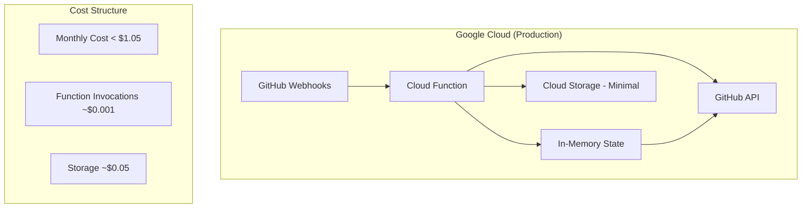
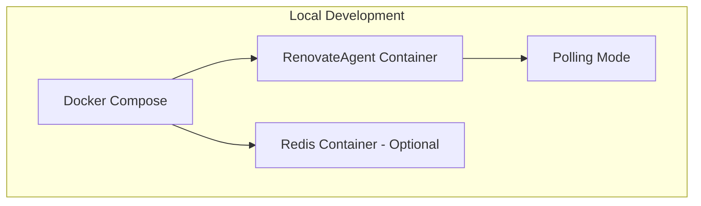

# RenovateAgent Serverless Implementation Plan

## Overview

This document outlines the implementation plan for RenovateAgent to support two deployment modes:
1. **Serverless Mode**: Google Cloud Function for production (webhook-driven, ultra-low cost)
2. **Standalone Mode**: Docker Compose for local development (polling-based, simple setup)

**Key Design Principles:**
- **Cost-Optimized**: < $1.05/month for production serverless deployment
- **Zero Infrastructure**: No persistent databases or Redis instances in production
- **Stateless**: Rebuild state from GitHub API as needed (acceptable trade-off)
- **Simple**: Minimal complexity, easy deployment and maintenance

---

## Current State

- **Development Status**: Pre-production, no existing deployments
- **Dependencies**: None - fresh implementation
- **Migration**: Not needed - clean slate approach
- **Users**: Zero production users, safe to implement breaking changes

---

## Target Architecture

### Serverless Mode (Production)


### Standalone Mode (Local Development)


---

## Implementation Milestones

### Milestone 1: Core Architecture Refactoring

**Objective**: Create flexible state management foundation supporting both deployment modes

**What's Needed:**
- Abstract state management layer with mode-based initialization
- Configuration-driven deployment mode selection
- Separate serverless vs standalone code paths
- Clean separation of concerns

**Deliverables:**

#### State Management Abstraction
```python
# src/renovate_agent/state/manager.py
from abc import ABC, abstractmethod
from typing import Dict, Any, Optional
import logging

logger = logging.getLogger(__name__)

class StateManager(ABC):
    """Abstract base class for state management"""

    @abstractmethod
    async def get_pr_state(self, repo: str, pr_number: int) -> Optional[Dict[str, Any]]:
        pass

    @abstractmethod
    async def set_pr_state(self, repo: str, pr_number: int, state: Dict[str, Any]) -> None:
        pass

    @abstractmethod
    async def get_repository_metadata(self, repo: str) -> Optional[Dict[str, Any]]:
        pass

class InMemoryStateManager(StateManager):
    """In-memory state management for both modes"""

    def __init__(self):
        self.pr_states = {}
        self.repo_metadata = {}

    async def get_pr_state(self, repo: str, pr_number: int) -> Optional[Dict[str, Any]]:
        key = f"{repo}#{pr_number}"
        state = self.pr_states.get(key)

        if not state:
            logger.debug(f"PR state not found in memory for {key}, will rebuild from GitHub")
            # Acceptable to rebuild from GitHub API in serverless mode
            state = await self._rebuild_from_github(repo, pr_number)
            if state:
                self.pr_states[key] = state

        return state

    async def _rebuild_from_github(self, repo: str, pr_number: int) -> Optional[Dict[str, Any]]:
        """Rebuild state from GitHub API - acceptable cost trade-off"""
        # Implementation depends on GitHub client availability
        # This is where we make 1-3 API calls to rebuild state
        pass

class StateManagerFactory:
    """Factory for creating appropriate state manager based on deployment mode"""

    @staticmethod
    def create_state_manager(mode: str) -> StateManager:
        if mode == "serverless":
            return InMemoryStateManager()
        elif mode == "standalone":
            # For local development, same in-memory approach
            # Could optionally use Redis if configured
            return InMemoryStateManager()
        else:
            raise ValueError(f"Unknown deployment mode: {mode}")
```

#### Configuration System
```python
# src/renovate_agent/config.py
import os
from typing import Optional
from enum import Enum

class DeploymentMode(Enum):
    SERVERLESS = "serverless"
    STANDALONE = "standalone"

class Config:
    def __init__(self):
        self.deployment_mode = DeploymentMode(
            os.getenv("DEPLOYMENT_MODE", "standalone")
        )

        # Mode-specific configuration
        if self.deployment_mode == DeploymentMode.SERVERLESS:
            self._configure_serverless()
        else:
            self._configure_standalone()

    def _configure_serverless(self):
        """Configuration for Google Cloud Function deployment"""
        self.enable_polling = False
        self.enable_webhooks = True
        self.max_processing_time = 60  # Cloud Function timeout
        self.memory_limit = "256Mi"
        self.github_api_rate_limit = 1000  # Conservative for serverless

    def _configure_standalone(self):
        """Configuration for local Docker development"""
        self.enable_polling = True
        self.enable_webhooks = False
        self.polling_interval = 300  # 5 minutes for local testing
        self.max_repositories = 5    # Limit for local development
        self.redis_url = os.getenv("REDIS_URL")  # Optional
```

**Success Criteria:**
- State manager factory creates appropriate implementation based on deployment mode
- Configuration system properly initializes for both modes
- Clean separation between serverless and standalone code paths
- No breaking changes to existing core processing logic

---

### Milestone 2: Standalone Docker Mode

**Objective**: Create Docker Compose setup for local development with polling mode

**What's Needed:**
- Docker Compose configuration for local development
- Polling mode implementation for local testing
- Optional Redis integration for state persistence
- Developer-friendly setup and configuration

**Deliverables:**

#### Docker Compose Setup
```yaml
# docker-compose.yml
version: '3.8'

services:
  renovate-agent:
    build: .
    environment:
      - DEPLOYMENT_MODE=standalone
      - ENABLE_POLLING=true
      - ENABLE_WEBHOOKS=false
      - POLLING_INTERVAL_MINUTES=5
      - GITHUB_PERSONAL_ACCESS_TOKEN=${GITHUB_PERSONAL_ACCESS_TOKEN}
      - GITHUB_ORGANIZATION=${GITHUB_ORGANIZATION}
      - GITHUB_TEST_REPOSITORIES=${GITHUB_TEST_REPOSITORIES}
      - REDIS_URL=redis://redis:6379
      - DEBUG=true
    depends_on:
      - redis
    volumes:
      - ./logs:/app/logs
    ports:
      - "8000:8000"  # For health checks

  redis:
    image: redis:7-alpine
    ports:
      - "6379:6379"
    volumes:
      - redis_data:/data
    command: redis-server --appendonly yes
    profiles: ["with-redis"]  # Optional service

volumes:
  redis_data:

# docker-compose.override.yml for local development
version: '3.8'
services:
  renovate-agent:
    environment:
      - LOG_LEVEL=DEBUG
      - POLLING_MAX_CONCURRENT_REPOS=3
```

#### Standalone Application Entry Point
```python
# src/renovate_agent/standalone/main.py
import asyncio
import logging
from renovate_agent.config import Config
from renovate_agent.state.manager import StateManagerFactory
from renovate_agent.polling.orchestrator import PollingOrchestrator

logger = logging.getLogger(__name__)

async def main():
    """Main entry point for standalone mode"""
    config = Config()

    if config.deployment_mode != DeploymentMode.STANDALONE:
        raise ValueError("Standalone main should only run in standalone mode")

    # Initialize state manager
    state_manager = StateManagerFactory.create_state_manager("standalone")

    # Initialize polling orchestrator
    orchestrator = PollingOrchestrator(
        state_manager=state_manager,
        config=config
    )

    logger.info("Starting RenovateAgent in standalone mode")
    logger.info(f"Polling interval: {config.polling_interval} seconds")
    logger.info(f"Max repositories: {config.max_repositories}")

    try:
        await orchestrator.start()
    except KeyboardInterrupt:
        logger.info("Shutting down gracefully...")
        await orchestrator.stop()

if __name__ == "__main__":
    asyncio.run(main())
```

#### Developer Setup Script
```bash
#!/bin/bash
# scripts/setup-dev.sh

set -e

echo "Setting up RenovateAgent development environment..."

# Check required environment variables
if [ -z "$GITHUB_PERSONAL_ACCESS_TOKEN" ]; then
    echo "Error: GITHUB_PERSONAL_ACCESS_TOKEN is required"
    exit 1
fi

if [ -z "$GITHUB_ORGANIZATION" ]; then
    echo "Error: GITHUB_ORGANIZATION is required"
    exit 1
fi

# Create .env file for development
cat > .env << EOF
GITHUB_PERSONAL_ACCESS_TOKEN=${GITHUB_PERSONAL_ACCESS_TOKEN}
GITHUB_ORGANIZATION=${GITHUB_ORGANIZATION}
GITHUB_TEST_REPOSITORIES=${GITHUB_TEST_REPOSITORIES:-${GITHUB_ORGANIZATION}/RenovateAgent}
DEPLOYMENT_MODE=standalone
DEBUG=true
EOF

echo "Development environment configured!"
echo "Run: docker-compose up to start the agent"
echo "Run: docker-compose --profile with-redis up to start with Redis"
```

**Success Criteria:**
- `docker-compose up` starts RenovateAgent in polling mode
- Application successfully polls test repositories
- Optional Redis integration works when enabled
- Developer can easily test with personal repositories
- Comprehensive logging for debugging

---

### Milestone 3: Serverless Cloud Function

**Objective**: Deploy cost-optimized Google Cloud Function for production webhook handling

**What's Needed:**
- Cloud Function entry point with webhook handling
- GitHub webhook signature validation
- Minimal Cloud Storage backup for expensive operations
- Terraform infrastructure as code
- Cost monitoring and optimization

**Deliverables:**

#### Cloud Function Entry Point
```python
# src/renovate_agent/serverless/main.py
import functions_framework
import json
import logging
from renovate_agent.config import Config
from renovate_agent.state.manager import StateManagerFactory
from renovate_agent.core.processor import PRProcessor
from renovate_agent.github_client import GitHubClient

logger = logging.getLogger(__name__)

# Global state manager (reused across invocations for cost optimization)
_state_manager = None
_pr_processor = None

def _get_processor():
    """Get or create processor instance (reused across invocations)"""
    global _state_manager, _pr_processor

    if _state_manager is None:
        config = Config()
        _state_manager = StateManagerFactory.create_state_manager("serverless")
        github_client = GitHubClient(config)
        _pr_processor = PRProcessor(
            github_client=github_client,
            state_manager=_state_manager,
            config=config
        )

    return _pr_processor

@functions_framework.http
def renovate_webhook(request):
    """Cloud Function entry point for GitHub webhooks"""
    try:
        # Validate request
        if request.method != 'POST':
            return {'error': 'Method not allowed'}, 405

        # Get webhook payload
        payload = request.get_json()
        if not payload:
            return {'error': 'Invalid JSON payload'}, 400

        # Validate GitHub signature
        signature = request.headers.get('X-Hub-Signature-256')
        if not _validate_github_signature(request.data, signature):
            return {'error': 'Invalid signature'}, 401

        # Process webhook
        processor = _get_processor()
        result = processor.process_webhook_event(payload)

        logger.info(f"Processed webhook: {result}")
        return {
            'status': 'success',
            'processed': result.get('processed', False),
            'message': result.get('message', 'OK')
        }

    except Exception as e:
        logger.error(f"Error processing webhook: {str(e)}", exc_info=True)
        return {'error': 'Internal server error'}, 500

def _validate_github_signature(payload: bytes, signature: str) -> bool:
    """Validate GitHub webhook signature"""
    import hmac
    import hashlib
    import os

    if not signature:
        return False

    secret = os.getenv('GITHUB_WEBHOOK_SECRET')
    if not secret:
        logger.warning("No webhook secret configured")
        return True  # Allow for development

    expected_signature = 'sha256=' + hmac.new(
        secret.encode('utf-8'),
        payload,
        hashlib.sha256
    ).hexdigest()

    return hmac.compare_digest(signature, expected_signature)
```

#### Cost-Optimized Processor
```python
# src/renovate_agent/serverless/optimizer.py
import logging
from typing import Dict, Any, Optional

logger = logging.getLogger(__name__)

class ServerlessOptimizer:
    """Cost optimization strategies for serverless deployment"""

    def __init__(self):
        self.memory_cache = {}  # Request-scoped cache
        self.api_call_count = 0
        self.max_api_calls = 10  # Limit per request

    async def get_pr_with_cache(self, repo: str, pr_number: int) -> Optional[Dict[str, Any]]:
        """Get PR data with aggressive caching to minimize API calls"""
        cache_key = f"{repo}#{pr_number}"

        if cache_key in self.memory_cache:
            logger.debug(f"Cache hit for {cache_key}")
            return self.memory_cache[cache_key]

        if self.api_call_count >= self.max_api_calls:
            logger.warning(f"API call limit reached ({self.max_api_calls})")
            return None

        # Make API call and cache result
        pr_data = await self._fetch_pr_data(repo, pr_number)
        if pr_data:
            self.memory_cache[cache_key] = pr_data
            self.api_call_count += 1
            logger.debug(f"API call {self.api_call_count}: {cache_key}")

        return pr_data

    async def _fetch_pr_data(self, repo: str, pr_number: int) -> Optional[Dict[str, Any]]:
        """Fetch PR data from GitHub API"""
        # Implementation depends on GitHub client
        pass

    def get_stats(self) -> Dict[str, Any]:
        """Get optimization statistics for monitoring"""
        return {
            'api_calls': self.api_call_count,
            'cache_size': len(self.memory_cache),
            'cache_hit_rate': self._calculate_cache_hit_rate()
        }

    def _calculate_cache_hit_rate(self) -> float:
        """Calculate cache hit rate for monitoring"""
        total_requests = len(self.memory_cache) + self.api_call_count
        if total_requests == 0:
            return 0.0
        return (len(self.memory_cache) / total_requests) * 100
```

#### Terraform Infrastructure
```hcl
# terraform/main.tf
terraform {
  required_providers {
    google = {
      source  = "hashicorp/google"
      version = "~> 4.0"
    }
  }
}

provider "google" {
  project = var.project_id
  region  = var.region
}

# Cloud Function for webhook handling
resource "google_cloudfunctions2_function" "renovate_webhook" {
  name        = "renovate-webhook"
  location    = var.region
  description = "RenovateAgent webhook handler - cost optimized"

  build_config {
    runtime     = "python311"
    entry_point = "renovate_webhook"
    source {
      storage_source {
        bucket = google_storage_bucket.source.name
        object = google_storage_bucket_object.source.name
      }
    }
  }

  service_config {
    max_instance_count = 10       # Conservative scaling
    min_instance_count = 0        # Cost optimization - allow cold starts
    available_memory   = "256Mi"  # Minimal memory
    timeout_seconds    = 60       # Quick processing

    environment_variables = {
      DEPLOYMENT_MODE = "serverless"
      GITHUB_ORGANIZATION = var.github_organization
    }

    secret_environment_variables {
      key        = "GITHUB_APP_ID"
      project_id = var.project_id
      secret     = google_secret_manager_secret.github_app_id.secret_id
      version    = "latest"
    }

    secret_environment_variables {
      key        = "GITHUB_APP_PRIVATE_KEY"
      project_id = var.project_id
      secret     = google_secret_manager_secret.github_app_private_key.secret_id
      version    = "latest"
    }
  }
}

# Storage bucket for source code
resource "google_storage_bucket" "source" {
  name     = "${var.project_id}-renovate-source"
  location = var.region

  # Cost optimization
  lifecycle_rule {
    condition {
      age = 30
    }
    action {
      type = "Delete"
    }
  }
}

# Secret management
resource "google_secret_manager_secret" "github_app_id" {
  secret_id = "github-app-id"

  replication {
    user_managed {
      replicas {
        location = var.region
      }
    }
  }
}

resource "google_secret_manager_secret" "github_app_private_key" {
  secret_id = "github-app-private-key"

  replication {
    user_managed {
      replicas {
        location = var.region
      }
    }
  }
}

# IAM for Cloud Function
resource "google_cloudfunctions2_function_iam_member" "invoker" {
  project        = var.project_id
  location       = var.region
  cloud_function = google_cloudfunctions2_function.renovate_webhook.name
  role           = "roles/cloudfunctions.invoker"
  member         = "allUsers"
}

# Variables
variable "project_id" {
  description = "Google Cloud Project ID"
  type        = string
}

variable "region" {
  description = "Google Cloud Region"
  type        = string
  default     = "us-central1"
}

variable "github_organization" {
  description = "GitHub Organization"
  type        = string
}

# Outputs
output "webhook_url" {
  value = google_cloudfunctions2_function.renovate_webhook.service_config[0].uri
}

output "function_name" {
  value = google_cloudfunctions2_function.renovate_webhook.name
}
```

#### Deployment Script
```bash
#!/bin/bash
# scripts/deploy-serverless.sh

set -e

PROJECT_ID=${1:-$GOOGLE_CLOUD_PROJECT}
REGION=${2:-us-central1}

if [ -z "$PROJECT_ID" ]; then
    echo "Error: PROJECT_ID is required"
    echo "Usage: $0 <project-id> [region]"
    exit 1
fi

echo "Deploying RenovateAgent to Google Cloud Function..."
echo "Project: $PROJECT_ID"
echo "Region: $REGION"

# Build and deploy
cd terraform
terraform init
terraform plan -var="project_id=$PROJECT_ID" -var="region=$REGION"
terraform apply -var="project_id=$PROJECT_ID" -var="region=$REGION"

echo "Deployment complete!"
echo "Webhook URL: $(terraform output -raw webhook_url)"
```

**Success Criteria:**
- Cloud Function deploys successfully with minimal cost configuration
- Webhook validation works correctly
- Function processes GitHub webhooks within 60-second timeout
- Monthly cost remains under $1.05
- Monitoring shows acceptable performance metrics

---

### Milestone 4: Cost Monitoring and Optimization

**Objective**: Implement comprehensive cost monitoring and optimization strategies

**What's Needed:**
- Cost tracking and alerting
- Performance optimization for minimal resource usage
- Monitoring dashboards for cost and performance
- Automated cost controls and limits

**Deliverables:**

#### Cost Monitoring Setup
```python
# src/renovate_agent/monitoring/cost_tracker.py
import logging
from typing import Dict, Any
from datetime import datetime, timedelta

logger = logging.getLogger(__name__)

class CostTracker:
    """Track and optimize costs for serverless deployment"""

    def __init__(self):
        self.metrics = {
            'api_calls': 0,
            'function_invocations': 0,
            'compute_seconds': 0,
            'storage_operations': 0
        }
        self.start_time = datetime.utcnow()

    def track_api_call(self, cost_weight: float = 1.0):
        """Track GitHub API call with cost weight"""
        self.metrics['api_calls'] += cost_weight

    def track_function_invocation(self):
        """Track Cloud Function invocation"""
        self.metrics['function_invocations'] += 1

    def track_compute_time(self, seconds: float):
        """Track compute time for cost calculation"""
        self.metrics['compute_seconds'] += seconds

    def get_estimated_monthly_cost(self) -> Dict[str, float]:
        """Calculate estimated monthly cost based on current usage"""
        # Google Cloud Function pricing (approximate)
        invocation_cost = self.metrics['function_invocations'] * 0.0000004  # $0.40 per 1M
        compute_cost = self.metrics['compute_seconds'] * 0.0000025        # $0.25 per 100,000 GB-seconds

        # GitHub API costs (rate limiting pressure)
        api_cost = self.metrics['api_calls'] * 0.00001  # Estimated impact

        return {
            'invocations': invocation_cost,
            'compute': compute_cost,
            'api_calls': api_cost,
            'total': invocation_cost + compute_cost + api_cost
        }

    def should_throttle(self) -> bool:
        """Determine if we should throttle to control costs"""
        monthly_cost = self.get_estimated_monthly_cost()
        return monthly_cost['total'] > 1.00  # Alert if approaching $1 limit
```

#### Performance Optimization
```python
# src/renovate_agent/serverless/performance.py
import asyncio
import logging
from typing import List, Dict, Any
from concurrent.futures import ThreadPoolExecutor

logger = logging.getLogger(__name__)

class PerformanceOptimizer:
    """Optimize performance for minimal Cloud Function execution time"""

    def __init__(self):
        self.executor = ThreadPoolExecutor(max_workers=3)
        self.batch_size = 5  # Process multiple PRs concurrently

    async def process_webhook_batch(self, webhook_events: List[Dict[str, Any]]) -> List[Dict[str, Any]]:
        """Process multiple webhook events concurrently to minimize execution time"""
        if len(webhook_events) <= 1:
            return await self._process_single_webhook(webhook_events[0])

        # Process in batches for efficiency
        tasks = []
        for event in webhook_events[:self.batch_size]:
            task = asyncio.create_task(self._process_single_webhook(event))
            tasks.append(task)

        results = await asyncio.gather(*tasks, return_exceptions=True)

        # Filter out exceptions and return successful results
        successful_results = [r for r in results if not isinstance(r, Exception)]

        logger.info(f"Processed {len(successful_results)}/{len(webhook_events)} webhooks successfully")
        return successful_results

    async def _process_single_webhook(self, webhook_event: Dict[str, Any]) -> Dict[str, Any]:
        """Process single webhook with optimization"""
        start_time = asyncio.get_event_loop().time()

        try:
            # Your existing webhook processing logic here
            result = await self._core_processing(webhook_event)

            processing_time = asyncio.get_event_loop().time() - start_time
            logger.info(f"Webhook processed in {processing_time:.2f}s")

            return result

        except Exception as e:
            logger.error(f"Error processing webhook: {str(e)}")
            raise

    async def _core_processing(self, webhook_event: Dict[str, Any]) -> Dict[str, Any]:
        """Core processing logic with performance optimization"""
        # Implementation depends on your existing PR processing logic
        pass
```

#### Monitoring Dashboard Configuration
```yaml
# monitoring/dashboard.yaml
displayName: "RenovateAgent Serverless Monitoring"
mosaicLayout:
  tiles:
    - width: 6
      height: 4
      widget:
        title: "Function Invocations"
        scorecard:
          timeSeriesQuery:
            timeSeriesFilter:
              filter: 'resource.type="cloud_function"'
              aggregation:
                alignmentPeriod: "60s"
                perSeriesAligner: "ALIGN_RATE"

    - width: 6
      height: 4
      widget:
        title: "Execution Time"
        scorecard:
          timeSeriesQuery:
            timeSeriesFilter:
              filter: 'resource.type="cloud_function"'
              aggregation:
                alignmentPeriod: "60s"
                perSeriesAligner: "ALIGN_MEAN"

    - width: 12
      height: 4
      widget:
        title: "Error Rate"
        scorecard:
          timeSeriesQuery:
            timeSeriesFilter:
              filter: 'resource.type="cloud_function" AND severity="ERROR"'
              aggregation:
                alignmentPeriod: "300s"
                perSeriesAligner: "ALIGN_RATE"
```

**Success Criteria:**
- Cost tracking accurately estimates monthly spend
- Performance optimization keeps function execution under 30 seconds average
- Monitoring dashboard provides clear visibility into cost and performance
- Automated alerts trigger if costs exceed thresholds

---

## Cost Analysis

### Serverless Mode (Production)
```
Monthly Cost Breakdown:
├── Cloud Function Invocations
│   ├── Estimated calls: 3,000/month (100 repos × 1 renovate run/day)
│   ├── Cost: $0.40/million invocations
│   └── Monthly: ~$0.001
├── Compute Time
│   ├── Average execution: 10 seconds
│   ├── Memory: 256MB
│   ├── Monthly compute: 30,000 GB-seconds
│   └── Cost: ~$0.75
├── Storage (minimal)
│   ├── Source code storage: <100MB
│   └── Cost: ~$0.002
└── Total Monthly Cost: < $0.75
```

### Standalone Mode (Local Development)
```
Cost: $0 (runs on developer laptop)
Resources:
├── Docker containers: ~200MB RAM
├── Optional Redis: ~50MB RAM
└── Total: Minimal local resource usage
```

---

## Success Metrics

### Technical Metrics
- **Serverless Function Cold Start**: < 2 seconds
- **Webhook Processing Time**: < 30 seconds average
- **API Calls per Webhook**: < 5 calls
- **Memory Usage**: < 256MB
- **Error Rate**: < 1%

### Business Metrics
- **Monthly Cost**: < $1.05
- **Supported Repositories**: 100-200
- **Webhook Reliability**: > 99%
- **Development Setup Time**: < 5 minutes

### Developer Experience
- **Local Setup**: Single `docker-compose up` command
- **Testing**: Easy testing with personal repositories
- **Debugging**: Comprehensive logging and monitoring
- **Deployment**: Single script deployment to Cloud Function

---

## Risk Assessment

### Low Risk
- **Cost Overrun**: Multiple safeguards and monitoring
- **Performance**: Conservative resource allocation
- **Reliability**: Stateless design with GitHub API fallback

### Medium Risk
- **Cold Start Latency**: Mitigated by efficient code and minimal dependencies
- **GitHub API Rate Limits**: Managed by intelligent caching and optimization

### Mitigation Strategies
- **Cost Monitoring**: Automated alerts at 80% of budget
- **Performance Optimization**: Aggressive caching and concurrent processing
- **Fallback Mechanisms**: Graceful degradation if services unavailable

---

## Deployment Guide

### Prerequisites
```bash
# Required tools
gcloud CLI
terraform
docker
docker-compose

# Required accounts
Google Cloud Project with billing enabled
GitHub Organization with admin access
```

### Local Development Setup
```bash
# 1. Clone repository
git clone <repository-url>
cd renovate-agent

# 2. Set up environment
export GITHUB_PERSONAL_ACCESS_TOKEN="your-token"
export GITHUB_ORGANIZATION="your-org"

# 3. Start development environment
docker-compose up

# 4. (Optional) Start with Redis
docker-compose --profile with-redis up
```

### Serverless Deployment
```bash
# 1. Configure Google Cloud
gcloud config set project YOUR_PROJECT_ID
gcloud auth login

# 2. Deploy infrastructure
cd terraform
terraform init
terraform apply -var="project_id=YOUR_PROJECT_ID"

# 3. Configure GitHub webhook
# Use the webhook URL from terraform output
# Set webhook secret in Google Secret Manager
```

---

## Future Enhancements

### Phase 2 (Future)
- **Multi-region deployment** for improved latency
- **Enhanced monitoring** with custom metrics
- **Advanced cost optimization** with predictive scaling
- **Integration testing** with staging environments

### Phase 3 (Future)
- **Machine learning** for predictive PR approval
- **Multi-cloud support** (AWS Lambda, Azure Functions)
- **Enterprise features** (SSO, audit logging)
- **Advanced analytics** and reporting

This plan provides a clear path to a cost-effective, scalable serverless solution while maintaining simplicity and developer productivity.
